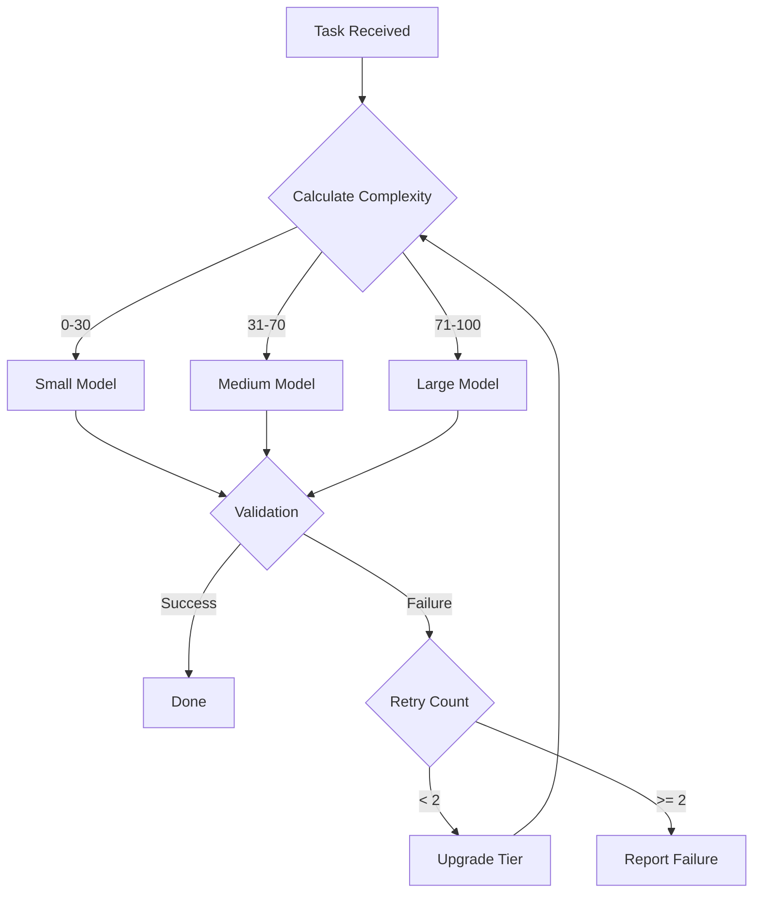

# Shared: Model Routing Configuration

This document defines the rules for routing tasks to appropriate model tiers, optimizing for both quality and cost.

## Model Tiers

| Tier | Models (Examples) | Token Cost | Best For |
|------|-------------------|------------|----------|
| Large | claude-opus-4-5, gpt-4 | $$$ | Orchestration, complex reasoning, architecture decisions |
| Medium | claude-sonnet-4-5, gpt-4o | $$ | Code generation, research, analysis |
| Small | claude-haiku, gpt-4o-mini | $ | Simple validation, formatting, quick lookups |

## Core Routing Principle

```text
Use the smallest model capable of completing the task successfully.
When in doubt, prefer Medium over Large - most tasks don't need Large.
```

## Subagent Model Assignments

| Subagent | Model Tier | Rationale |
|----------|------------|-----------|
| Orchestrator | Large | Strategic decisions, context management, workflow coordination |
| Session Initializer | Small | Structured parsing, validation, no complex reasoning |
| Context Compactor | Medium | Requires judgment for summarization quality |
| Coder | Medium | Code generation requires moderate reasoning |
| Tester | Medium | Test logic requires moderate reasoning |
| QA Validator | Medium | Holistic analysis requires broader reasoning |
| Web Researcher | Small | Simple extraction, summarization |
| Git Handler | Small | Structured commands, no reasoning needed |
| PR Resolver | Medium | Requires understanding PR context and comments |
| Doc Reviewer | Small | Pattern matching, lint validation |
| Security Auditor | Medium | Security analysis requires deeper reasoning |
| Dependency Manager | Small | Structured parsing, version comparison |
| Issue Creator | Medium | Requires understanding user intent |
| Issue Resolver | Medium | Full development workflow |
| Commit Reviewer | Medium | Code review requires judgment |

## Task Complexity Routing

### Route to Small

```text
Tasks that are:
├── Pattern matching
├── Structured data extraction
├── Simple validation
├── Formatting and linting
├── Git operations
├── File existence checks
├── Quick lookups
└── Token counting
```

### Route to Medium

```text
Tasks that are:
├── Code generation
├── Test writing
├── Research synthesis
├── Code review
├── Documentation writing
├── Error analysis
├── Refactoring
└── Multi-step procedures
```

### Route to Large

```text
Tasks that are:
├── Architecture decisions
├── Cross-cutting concerns
├── Ambiguity resolution
├── Strategic planning
├── Complex debugging
├── Novel problem solving
└── Full workflow orchestration
```

## Dynamic Routing Rules

### Upgrade Triggers

Route to higher tier when:

| Condition | Action |
|-----------|--------|
| Task complexity score > 80 | Upgrade one tier |
| Previous attempt failed | Upgrade one tier |
| Security-sensitive code | Minimum Medium |
| Architecture-impacting change | Require Large |
| Ambiguity requires judgment | Upgrade one tier |

### Downgrade Triggers

Route to lower tier when:

| Condition | Action |
|-----------|--------|
| Task is retry with clear fix | Downgrade one tier |
| Similar task succeeded at lower tier | Try lower tier first |
| Token budget constrained | Prefer smaller model |
| Time-critical batch | Prefer smaller model |

## Complexity Scoring

Calculate task complexity (0-100) based on:

| Factor | Weight | Scoring |
|--------|--------|---------|
| Files involved | 20% | 1 file: 10, 2-5: 30, 6+: 50 |
| Reasoning steps | 30% | 1-2: 10, 3-5: 30, 6+: 50 |
| Ambiguity level | 25% | Clear: 10, Some: 30, High: 50 |
| Risk level | 25% | Low: 10, Medium: 30, High: 50 |

### Complexity Thresholds

| Score Range | Recommended Tier |
|-------------|-----------------|
| 0-30 | Small |
| 31-70 | Medium |
| 71-100 | Large |

## Cost Awareness Guidelines

### Token Budget Allocation

```text
Session Budget (example: 100k tokens)
├── Orchestrator: 30% (30k)
├── Primary Subagents: 40% (40k)
├── Support Subagents: 20% (20k)
└── Reserve: 10% (10k)
```

### Cost Optimization Strategies

1. **Batch Similar Tasks**: Group validation tasks for single Small model call
2. **Cache Expensive Results**: Store Large model decisions for reuse
3. **Progressive Enhancement**: Start Small, upgrade only if needed
4. **Early Termination**: Stop analysis when conclusion is clear
5. **Summary Pass-Through**: Use summaries instead of full context

### Anti-Patterns to Avoid

| Anti-Pattern | Problem | Fix |
|--------------|---------|-----|
| Always use Large | Wastes tokens and money | Apply routing rules |
| Retry at same tier | May repeat same failure | Upgrade tier on retry |
| Full context to Small | Exceeds capability | Summarize or upgrade |
| Large for formatting | Overkill | Use Small |
| Small for security | Insufficient analysis | Minimum Medium |

## Model Selection Flowchart



## Integration with Subagent Contract

When spawning a subagent, include model routing:

```markdown
## Task Assignment

**Task ID**: TASK-XXX
**Objective**: [Clear goal]
**Model Tier**: [Small | Medium | Large]
**Complexity Score**: [0-100]
**Upgrade Authorized**: [Yes | No]
**Token Budget**: [X tokens]
```

## Monitoring and Adjustment

### Track These Metrics

| Metric | Purpose |
|--------|---------|
| Success rate by tier | Validate routing accuracy |
| Token usage by task type | Optimize allocation |
| Upgrade frequency | Identify miscategorized tasks |
| Cost per task type | Budget planning |

### Routing Refinement

Every 100 tasks, review:

1. Tasks that required upgrade → Consider default higher tier
2. Tasks that succeeded at lower tier → Consider default lower tier
3. High failure rate tasks → Analyze complexity factors

## Examples

### Example 1: Git Commit Message

```text
Task: Generate commit message from diff
Complexity: Files=1, Reasoning=1, Ambiguity=Low, Risk=Low
Score: 15
Routed To: Small
Rationale: Structured output, clear input, no judgment needed
```

### Example 2: Implement Feature

```text
Task: Add user authentication endpoint
Complexity: Files=5, Reasoning=5, Ambiguity=Some, Risk=Medium
Score: 55
Routed To: Medium
Rationale: Code generation with moderate complexity
```

### Example 3: Architecture Decision

```text
Task: Design microservices migration strategy
Complexity: Files=20+, Reasoning=10+, Ambiguity=High, Risk=High
Score: 90
Routed To: Large
Rationale: Cross-cutting concerns, high ambiguity, strategic impact
```

## See Also

| Related | Purpose |
|---------|---------|
| [Subagent Contract](./subagent-contract.md) | Task assignment format |
| [Timeout Budgets](./timeout-budgets.md) | Execution limits |
| [Subagents README](../subagents/README.md) | All subagent specifications |
| [Autonomous Orchestration](../concepts/autonomous-orchestration.md) | Workflow coordination |
