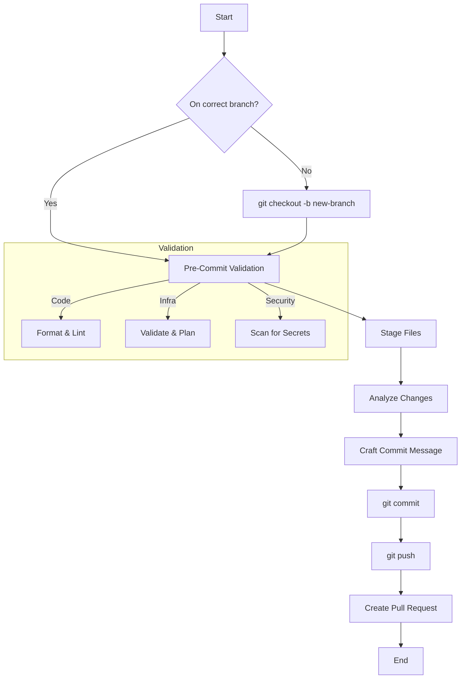

# Task: Commit

This task outlines the complete, systematic workflow for creating high-quality, standardized git commits, from branching to message formatting.

## Workflow Overview



## Branching Strategy

Before committing, ensure you are on the correct branch. Never commit directly to `main`.

- **Branch Naming**: Use a descriptive prefix and name, separated by a slash.
    - `feat/<description>`: For new features.
    - `fix/<description>`: For bug fixes.
    - `docs/<description>`: For documentation-only changes.
    - `chore/<description>`: For maintenance tasks (e.g., dependency updates).
    - `refactor/<description>`: For code restructuring without changing functionality.
    - `test/<description>`: For adding or modifying tests.
- **Example**: `git checkout -b feat/add-user-authentication`

## Pre-Commit Validation

Before staging files, run all relevant validation checks.

- **Code Formatting**: `terraform fmt`, `prettier --write .`, etc.
- **Linting**: `markdownlint-cli2 .`, `eslint .`, etc.
- **Infrastructure**: `terraform validate` and `terragrunt plan`.
- **Security**: Scan for sensitive data (API keys, secrets).

## Staging and Analysis

1.  **Stage Files**: Use `git add <file>` to stage changes. Group files into logical commits.
2.  **Analyze Changes**:
    - `git status -v -v`: Review all staged and unstaged changes.
    - `git log --oneline -n 5`: Understand recent commit history.

## Commit Message Format

All commit messages must follow the [Conventional Commits](https://www.conventionalcommits.org/) specification.

### Structure

```
<type>(<scope>): <subject>
<BLANK LINE>
<body>
<BLANK LINE>
<footer>
```

-   **Type**: `feat`, `fix`, `docs`, `style`, `refactor`, `test`, `chore`.
-   **Scope** (optional): The part of the codebase affected (e.g., `auth`, `db`, `ui`).
-   **Subject**: A concise description of the change, in lowercase, under 72 characters.
-   **Body** (optional): A more detailed explanation of the changes, the "why" behind them, and any impact on cloud resource costs.
-   **Footer** (optional): Reference related issues (e.g., `Fixes #123`).

### Examples

**Simple Commit:**
```
feat(auth): implement passwordless login via email links
```

**Complex Commit:**
```
fix(api): resolve intermittent 502 errors on user-service

The user-service was experiencing connection timeouts to the Redis cache
during periods of high load. This was caused by an insufficient connection
pool size.

- Increased the Redis connection pool from 10 to 50.
- Added exponential backoff for connection retries.
- Improved logging to capture connection pool metrics.

This change has no direct cost impact but should improve API reliability.

Refs: #456
```

## Finalizing the Commit

After crafting the message, commit the changes using `git commit`. Then, push the branch to the remote repository (`git push -u origin <branch-name>`) and proceed to create a pull request.