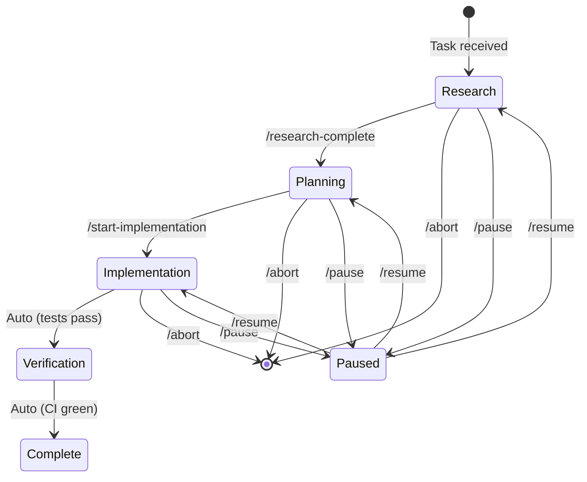

# Workflow Transition Commands

These slash commands provide hard transitions between workflow phases. They are the canonical way to signal phase completion in [Attended Mode](../concepts/user-presence-modes.md).

## Command Reference

### `/research-complete`

Signals that the Research phase is complete.

**Effect:**

- Validates research artifacts exist
- Transitions to Planning phase
- In attended mode: Initiates PRD discussion with user
- In other modes: Auto-generates PRD

**Prerequisites:**

- Must have read relevant codebase files
- Must have documented findings in active-context.md or progress notes

**Usage:**

```text
/research-complete
```

---

### `/start-implementation`

Locks the PRD and begins the Implementation phase.

**Effect:**

- Marks PRD as LOCKED (no further changes)
- Validates PRD completeness
- Transitions to zero-interaction coding mode
- AI begins executing Implementation Plan checklist

**Prerequisites:**

- PRD must exist at `.tmp/prd-<task-name>.md`
- PRD must have all required sections
- In attended mode: User has reviewed and approved PRD

**Usage:**

```text
/start-implementation
```

**Critical:** Once executed, the AI will not request user input until task completion or hard-stop condition.

---

### `/pause`

Saves current state and pauses execution.

**Effect:**

- Creates checkpoint in active-context.md
- Commits any uncommitted valid work
- Documents current progress
- Enters idle state

**Usage:**

```text
/pause
```

**Recovery:** Use `/resume` to continue from checkpoint.

---

### `/resume`

Resumes from the last checkpoint.

**Effect:**

- Loads checkpoint from active-context.md
- Validates file system state matches checkpoint
- Auto-reconciles if mismatch detected
- Continues execution from last incomplete step

**Usage:**

```text
/resume
```

---

### `/abort`

Aborts current task and rolls back to last clean state.

**Effect:**

- Reverts uncommitted changes
- Updates task-queue.md to mark task as aborted
- Documents abort reason
- Returns to idle state

**Usage:**

```text
/abort [reason]
```

**Warning:** This is destructive. Uncommitted work will be lost.

---

### `/set-mode`

Changes the user presence mode.

**Effect:**

- Updates session mode
- Adjusts watchdog timeouts
- Adjusts interaction level

**Usage:**

```text
/set-mode attended
/set-mode semi-attended
/set-mode unattended
```

See [User Presence Modes](../concepts/user-presence-modes.md) for mode details.

---

### `/status`

Reports current session status.

**Effect:**

- Shows current workflow phase
- Shows current mode
- Shows active task and progress
- Shows pending tasks in queue

**Usage:**

```text
/status
```

---

## Command Validation

All transition commands validate preconditions before executing:

| Command | Validates |
|---------|-----------|
| `/research-complete` | Research artifacts exist, context documented |
| `/start-implementation` | PRD exists, has required sections, is complete |
| `/pause` | Current state is saveable |
| `/resume` | Checkpoint exists, is valid |
| `/abort` | Has confirmation or reason |

## Phase Transitions



## Mode-Specific Behavior

### Attended Mode

All transitions require explicit user command:

- `/research-complete` - User must execute
- `/start-implementation` - User must execute
- Completion - User notified, awaits next task

### Semi-Attended Mode

Soft auto-transitions with grace periods:

- Research → Planning: Auto after 2 min idle
- Planning → Implementation: Auto after PRD creation + 2 min grace
- Completion: Auto-continue to next task

### Unattended Mode

Immediate auto-transitions:

- Research → Planning: Immediate on completion
- Planning → Implementation: Immediate after PRD generation
- Completion: Immediate queue next task

## Error Handling

If a transition command fails:

1. Log failure reason
2. Report to user (if attended) or log (if unattended)
3. Remain in current phase
4. Provide remediation steps

Example failure:

```text
❌ /start-implementation failed

Reason: PRD missing required section "Success Metrics"
File: .tmp/prd-auth-feature.md

Remediation:
1. Add "## Success Metrics" section to PRD
2. Define measurable success criteria
3. Re-execute /start-implementation
```
