# Architecture Diagrams

This document provides visual diagrams of key workflows and concepts in the AI assistant instruction system.

## System Overview

### Full Autonomous Architecture

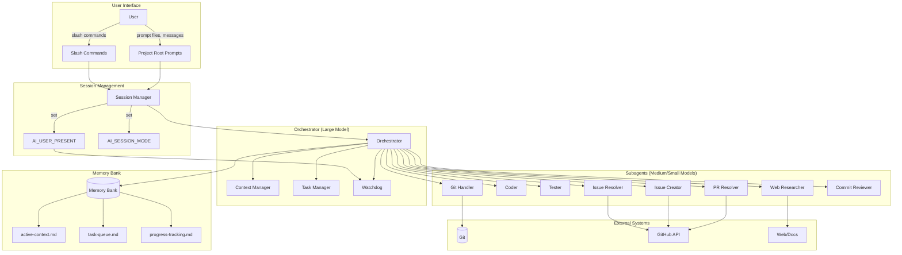

## Workflow State Machine

### 5-Step Development Workflow

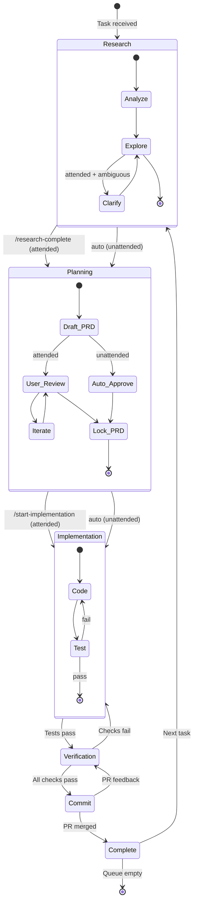

## User Presence Mode Decision Tree

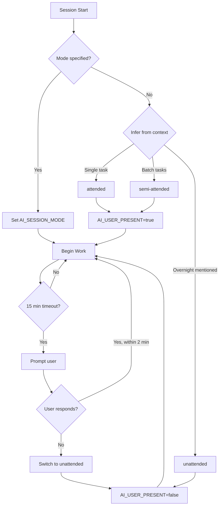

## Self-Healing Decision Flow

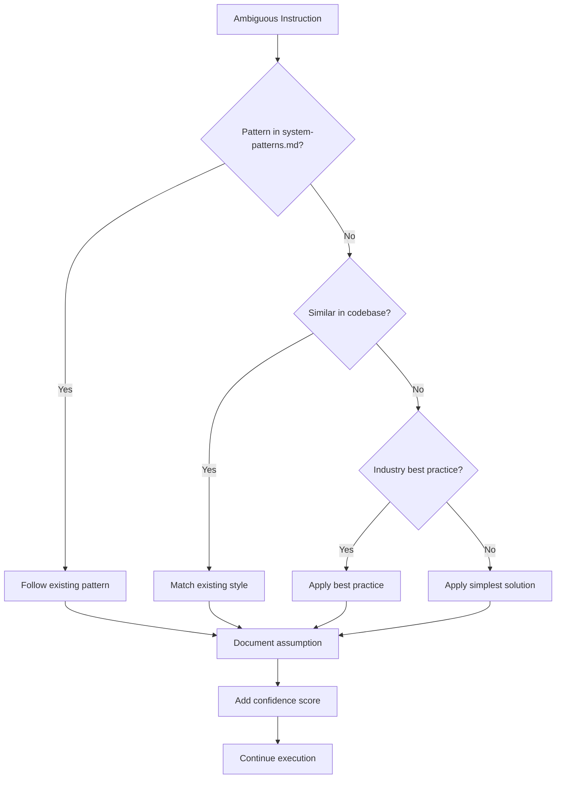

## Error Recovery and 5 Whys

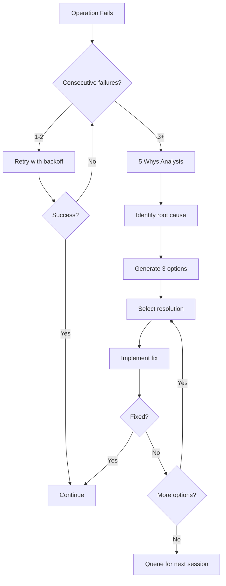

## Parallel Issue Resolution

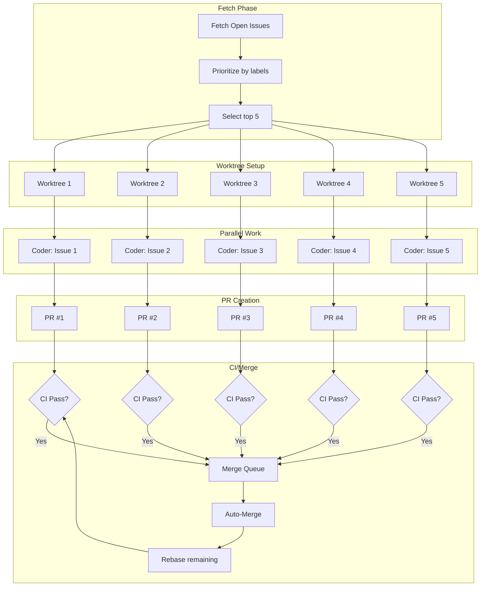

## Watchdog Mechanism

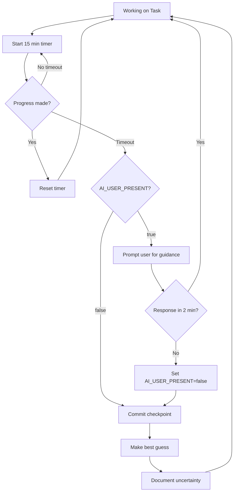

## Hard Protections Check

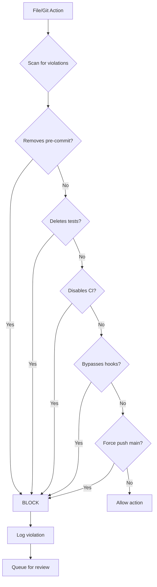

## Commit Review Pipeline

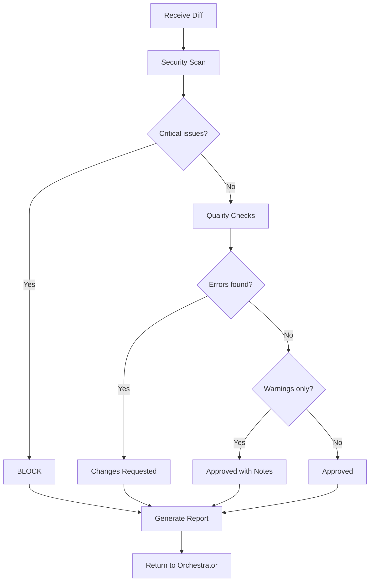

## Subagent Coordination

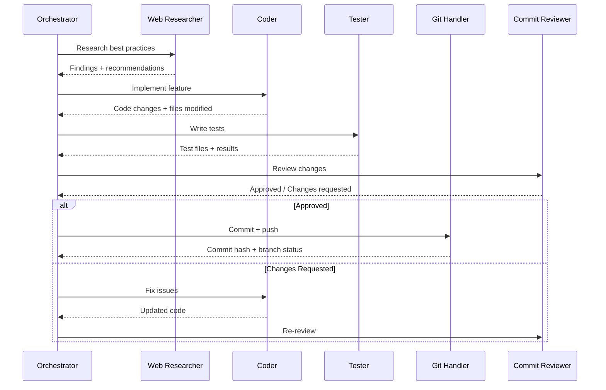

## Memory Bank Data Flow

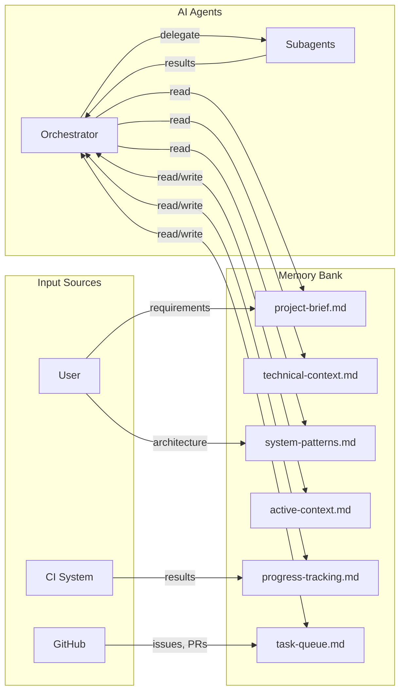
