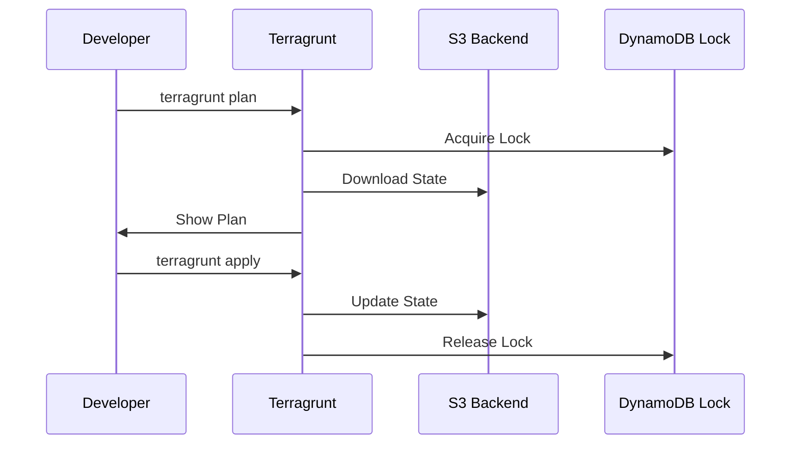
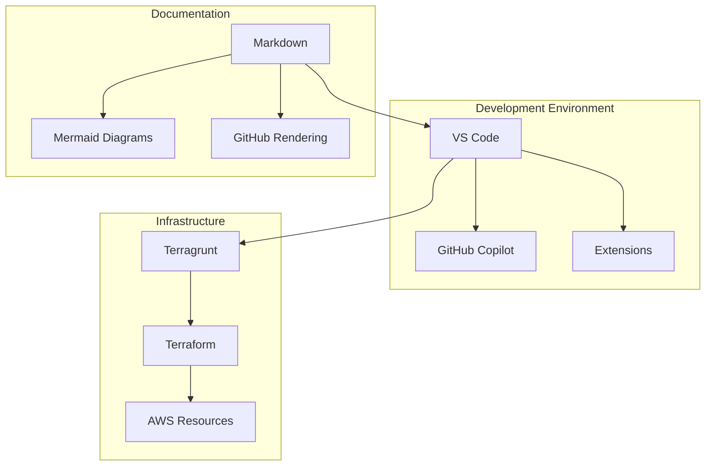
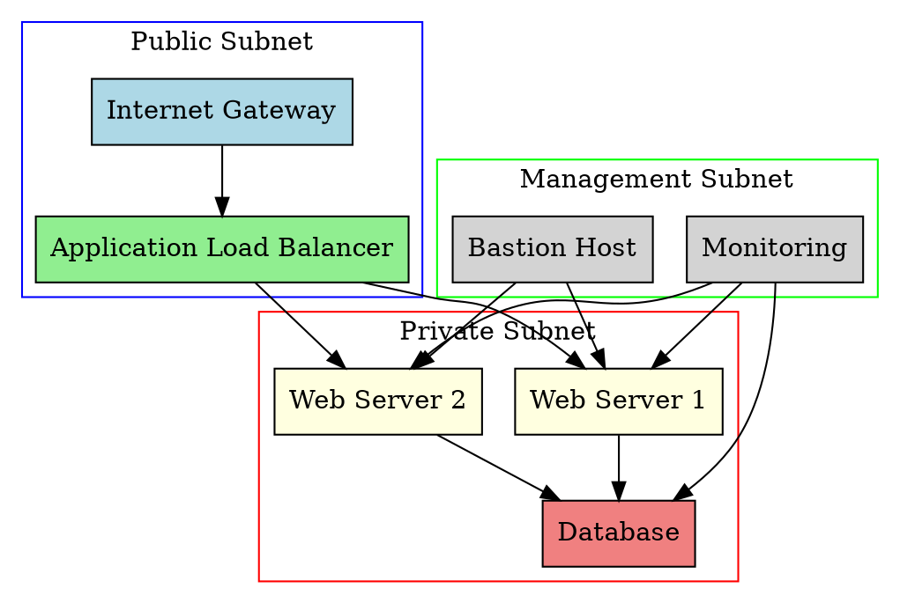

# Architecture Overview

> **Navigation**: [Project Overview](../../README.md) → [Project Scope](project-scope.md) → **Architecture Details**

## System Design Philosophy

This AI assistant instruction system is designed with modularity, maintainability, and AI-optimization in mind.
The architecture follows GitHub's recommended patterns for Copilot custom instructions while extending beyond
basic repository instructions to include comprehensive workspace management.

## File Structure Architecture

### Primary Instruction Files

```text
.github/
├── copilot-instructions.md          # Main repository-wide AI instructions
└── prompts/                         # Reusable prompt templates
    ├── documentation-check.prompt.md # Documentation consistency checks
    ├── git-workflow.prompt.md       # Git commit and workflow standards
    ├── infrastructure-review.prompt.md # Infrastructure code reviews
    └── security-review.prompt.md    # Security assessment prompts

.copilot/
├── PROJECT.md                       # Project scope and boundaries
├── ARCHITECTURE.md                  # This file - system design decisions
└── WORKSPACE.md                     # Multi-project workspace guidelines
```

### Design Rationale

#### Separation of Concerns

- **`.github/copilot-instructions.md`**: Repository-wide context only
  - Short, focused instructions that apply to all conversations
  - Technology preferences and general best practices
  - Security and cost management principles

- **`.copilot/` Directory**: Detailed context and architecture decisions
  - PROJECT.md: Scope, boundaries, and change management
  - ARCHITECTURE.md: Technical implementation details and design decisions
  - WORKSPACE.md: Multi-repository workspace management

- **`.github/prompts/`**: Task-specific reusable prompts
  - Documentation consistency validation
  - Git commit and workflow standards
  - Infrastructure review workflows
  - Security assessment checklists

#### AI Optimization Principles

1. **Clear Hierarchical Structure**: Files reference each other explicitly
2. **Concise Main Instructions**: Keep primary file under GitHub's recommended limits
3. **Contextual Depth**: Detailed guidelines available when needed
4. **Cross-Reference Navigation**: Easy movement between related concepts
5. **Diagram Standards**: Consistent visual documentation approach

#### Diagram-as-Code Standards

##### Primary Choice: Mermaid

- Default for all workflow diagrams, flowcharts, sequence diagrams
- Native GitHub rendering support
- AI-friendly syntax for automated generation
- Excellent VS Code integration with live preview

##### Secondary Choice: GraphViz (DOT)

- Reserved for complex network topologies and system architecture
- Superior layout algorithms for large, interconnected systems
- Use when Mermaid becomes too cluttered or inadequate

##### Usage Guidelines

- Always prefer Mermaid unless complexity demands GraphViz
- Include language tags in code blocks for proper syntax highlighting
- Provide both diagram code and rendered output in documentation
- Keep diagrams focused and avoid overcrowding

### Diagram Examples

#### Mermaid Examples (Preferred)

**Git Workflow:**


**Infrastructure State Management:**



**Project Architecture:**



#### GraphViz Examples (Complex Topologies Only)

**Network Topology (Complex Infrastructure):**



**When to Use Each:**

- **Mermaid**: Workflows, processes, simple architectures, sequence diagrams
- **GraphViz**: Complex network topologies, large system architectures, interconnected systems with 10+ components

## Technology Stack Decisions

### Core Technologies

| Technology | Decision | Rationale |
| ---------- | -------- | --------- |
| **Infrastructure** | Terraform + Terragrunt | Industry standard, cost management, state isolation |
| **Cloud Provider** | AWS (primary) | Extensive free tier, mature ecosystem |
| **Region Preference** | us-east-2 | Cost optimization, latency considerations |
| **Scripting** | PowerShell (Windows), Bash (Unix) | Platform-appropriate automation |
| **Documentation** | Markdown with strict linting | AI-friendly, version controllable |

### Development Environment

- **Primary IDE**: Visual Studio Code with Copilot integration
- **Version Control**: Git with GitHub CLI for automation
- **Package Management**: Chocolatey (Windows), native package managers (Unix)
- **Container Platform**: Proxmox or Docker with multi-stage builds

### Security Architecture

#### Secrets Management

- Environment variables for development
- AWS Systems Manager Parameter Store for cloud resources
- Never commit secrets to version control
- Regular rotation of access keys and tokens

#### Access Control

- Principle of least privilege for all IAM policies
- Role-based access for cloud resources
- Multi-factor authentication for administrative and non-automated access

## Workflow Integration

### Git Workflow


### AI Assistance Integration Points

1. **Code Generation**: Copilot uses instructions for language-specific patterns
2. **Documentation**: Automated consistency checks and formatting
3. **Infrastructure**: Terraform plan validation and cost estimation
4. **Security**: Automated vulnerability scanning and compliance checks

## Scalability Considerations

### File Size Management

- Main instruction file kept under 1000 lines
- Modular architecture allows selective loading
- Cross-references enable navigation without duplication

### Multi-Project Support

- Workspace-level configurations in git.code-workspace
- Project-specific instructions in individual repositories
- Shared templates and patterns across projects

### Performance Optimization

- Minimal context loading for simple requests
- Detailed context available on-demand through references
- Efficient prompt file organization for quick access

## Decision Log

### 2025-06-04: Initial Architecture Design

**Decision**: Adopt modular instruction architecture with clear separation between repository-wide and detailed context.

**Alternatives Considered**:

- Single large instruction file (rejected: becomes unwieldy)
- Per-technology instruction files (rejected: too fragmented)

**Rationale**: Balance between GitHub Copilot best practices and comprehensive workspace management needs.

### 2025-06-04: Prompt File Organization

**Decision**: Organize prompt files by functional area (infrastructure, security, documentation) rather than by technology.

**Rationale**: Functional organization promotes reusability across different technology stacks and reduces duplication.

---

*For implementation details, see [workspace-management.md](workspace-management.md)*
*For project scope, see [project-scope.md](project-scope.md)*
