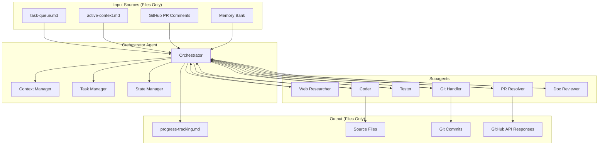

# Concept: Autonomous Orchestration

This document defines the architecture for fully autonomous AI agent operation where the orchestrator receives instructions exclusively from files, never directly from users.

## Core Principle: File-Driven Autonomy

The orchestrator agent operates in a closed loop:

1. **Read instructions from files** (task queue, memory-bank, PR comments)
2. **Delegate to specialized subagents**
3. **Write results back to files**
4. **Update state and progress**
5. **Repeat until task queue is empty**



## Orchestrator Responsibilities

### 1. Context Manipulation (Primary Role)

The orchestrator is the **sole agent** responsible for:

- Reading and parsing the task queue
- Loading relevant context from memory-bank
- Compacting context when approaching token limits
- Deciding what context each subagent receives
- Summarizing subagent outputs before storing

### 2. File Management (Primary Role)

The orchestrator is the **sole agent** that writes to:

- `task-queue.md` - Adding, updating, removing tasks
- `active-context.md` - Current working state
- `progress-tracking.md` - Completion status
- Any documentation files

Subagents may only write to:

- Source code files (Coder)
- Test files (Tester)
- Git operations (Git Handler)
- GitHub API (PR Resolver)

### 3. Task Coordination

The orchestrator:

- Parses task dependencies
- Determines execution order
- Spawns subagents with precise instructions
- Collects and validates results
- Handles failures and retries

## Task Queue Format

Location: `.ai-instructions/concepts/memory-bank/task-queue.md`

```markdown
# Task Queue

## Active Tasks

### TASK-001: Implement user authentication
- **Status**: in_progress
- **Assigned**: Coder
- **Dependencies**: TASK-000 (completed)
- **Context Files**:
  - src/auth/
  - tests/auth/
- **Success Criteria**:
  - [ ] All tests pass
  - [ ] No security vulnerabilities
  - [ ] PR created and reviewed

### TASK-002: Review PR #42 comments
- **Status**: pending
- **Assigned**: PR Resolver
- **Dependencies**: none
- **Context Files**:
  - PR #42 diff
  - Review comments
- **Success Criteria**:
  - [ ] All comments addressed
  - [ ] Conversations resolved in GitHub

## Completed Tasks

### TASK-000: Set up project structure
- **Status**: completed
- **Completed**: 2025-01-15T10:30:00Z
- **Output**: Initial project scaffold created
```

## Subagent Specifications

Each subagent has a strict contract:

| Subagent | Input | Output | Can Write To |
|----------|-------|--------|--------------|
| Web Researcher | Search queries, URLs | Summarized findings | Nothing (returns to orchestrator) |
| Coder | Requirements, context | Code changes | Source files only |
| Tester | Test requirements | Test files, results | Test files only |
| Git Handler | Commit instructions | Git operations | Git only |
| PR Resolver | PR number, comments | Resolution status | GitHub API only |
| Doc Reviewer | File paths | Lint results, suggestions | Nothing (returns to orchestrator) |

## State Persistence

### Checkpoint System

The orchestrator creates checkpoints after each significant action:

```markdown
# Checkpoint: 2025-01-15T10:45:00Z

## Current Task
TASK-001: Implement user authentication

## Progress
- [x] Coder: Created auth module
- [x] Tester: Wrote unit tests
- [ ] Tester: Run tests
- [ ] Git Handler: Commit changes

## Pending Subagent Calls
- Tester: Execute test suite

## Recovery Instructions
If resuming from this checkpoint:
1. Skip completed steps
2. Resume from "Tester: Run tests"
3. Context needed: src/auth/, tests/auth/
```

### Recovery Protocol

On session start, the orchestrator:

1. Reads `active-context.md` for last checkpoint
2. Validates current file state matches checkpoint
3. Resumes from last incomplete step
4. If state mismatch: flags for human review

## Error Handling

### Subagent Failure

```markdown
## Error Protocol

1. Log error with full context
2. Determine if retryable:
   - Network timeout → Retry 3x with backoff
   - Validation error → Return to orchestrator for re-planning
   - Permission denied → Flag for human review
3. Update checkpoint with failure state
4. If unrecoverable: Write to `errors.md` and halt task
```

### Context Overflow

When approaching token limits:

1. Summarize completed subagent outputs
2. Archive detailed logs to `.tmp/logs/`
3. Keep only essential context for current task
4. Reference archived logs in checkpoint

## Security Model

### Orchestrator Permissions

The orchestrator has elevated permissions but must:

- Never execute arbitrary user commands
- Only read from designated input files
- Only write to designated output locations
- Log all file operations

### Subagent Isolation

Each subagent:

- Receives only task-specific context
- Cannot access other subagents' outputs directly
- Cannot modify orchestrator state
- Returns results to orchestrator for validation

## Integration Points

### With Memory Bank

- `project-brief.md` - Read-only, provides project context
- `technical-context.md` - Read-only, provides tech stack info
- `system-patterns.md` - Read-only, provides architecture patterns
- `active-context.md` - Read/Write by orchestrator only
- `progress-tracking.md` - Read/Write by orchestrator only
- `task-queue.md` - Read/Write by orchestrator only

### With Git

All git operations go through the Git Handler subagent:

- Orchestrator requests: "Commit with message X"
- Git Handler executes and returns status
- Orchestrator updates progress

### With GitHub

All GitHub operations go through the PR Resolver subagent:

- Orchestrator provides PR number and action
- PR Resolver executes API calls
- PR Resolver returns success/failure
- Orchestrator updates task status

## Autonomy Boundaries

### The Orchestrator Will

- Execute all tasks in the queue without user intervention
- Make implementation decisions within defined patterns
- Retry failed operations with exponential backoff
- Update progress continuously

### The Orchestrator Will Not

- Accept direct user commands during execution
- Modify files outside its designated scope
- Continue past unrecoverable errors
- Make architectural decisions not in `system-patterns.md`

### Human Intervention Points

The orchestrator halts and requests human review when:

1. Task queue is empty
2. Unrecoverable error occurs
3. Security-sensitive operation detected
4. Ambiguous requirements found
5. Architecture decision needed not covered by patterns
