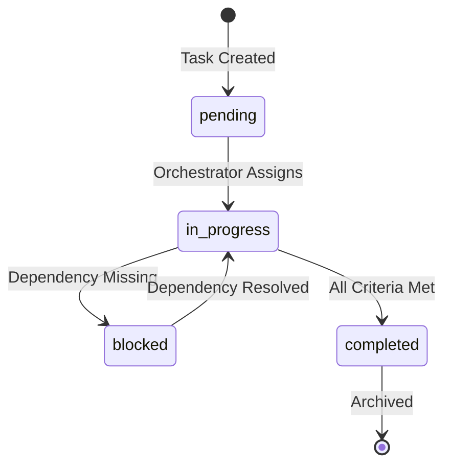

# Task Queue

This file is the orchestrator's input source. Tasks are added here and processed autonomously.

See [Autonomous Orchestration](../autonomous-orchestration.md) for the full system design.

## Queue Format

Tasks follow a strict format for machine parsing:

```markdown
### TASK-XXX: [Title]
- **Status**: pending | in_progress | blocked | completed
- **Priority**: critical | high | medium | low
- **Assigned**: [Subagent name or "orchestrator"]
- **Dependencies**: [TASK-XXX, TASK-YYY] or "none"
- **Context Files**:
  - [file path 1]
  - [file path 2]
- **Success Criteria**:
  - [ ] Criterion 1
  - [ ] Criterion 2
- **Notes**: [Any additional context]
```

## Active Tasks

<!-- Add new tasks below this line -->

### TASK-000: Example Task (Template)

- **Status**: pending
- **Priority**: medium
- **Assigned**: orchestrator
- **Dependencies**: none
- **Context Files**:
  - README.md
- **Success Criteria**:
  - [ ] Task completed successfully
- **Notes**: This is a template task for reference

## Completed Tasks

<!-- Completed tasks are moved here with completion timestamp -->

## Task Lifecycle



## Priority Guidelines

| Priority | Criteria | Response Time |
|----------|----------|---------------|
| critical | Security issue, production down | Immediate |
| high | Blocking other work, PR feedback | Same session |
| medium | Normal development work | Next available |
| low | Nice to have, tech debt | When convenient |

## Parallel Execution

Per [Parallelism](../parallelism.md), independent tasks can run simultaneously:

```text
TASK-001 (pending, no deps) ─┬─► Run in parallel
TASK-002 (pending, no deps) ─┘
TASK-003 (pending, deps: TASK-001) ─► Wait for TASK-001
```
