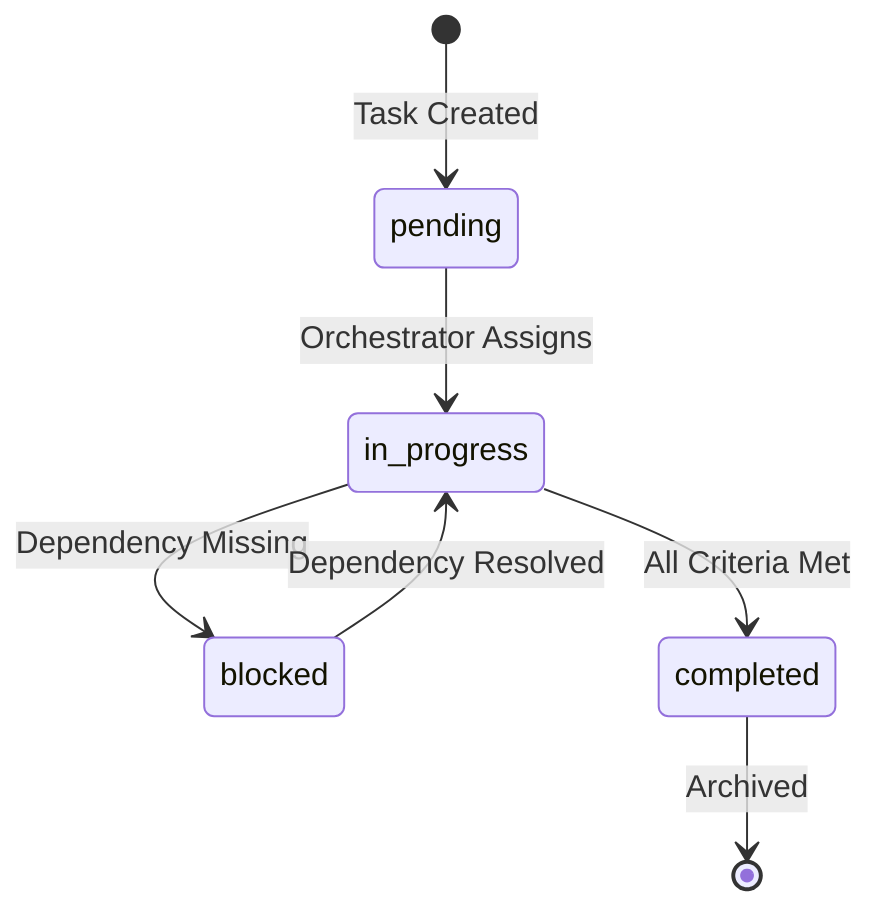

# Task Queue

This file is the orchestrator's input source. Tasks are added here and processed autonomously.

See [Autonomous Orchestration](../autonomous-orchestration.md) for the full system design.

## Queue Format

Tasks follow a strict format for machine parsing:

```markdown
### TASK-XXX: [Title]
- **Status**: pending | in_progress | blocked | completed
- **Priority**: critical | high | medium | low
- **Assigned**: [Subagent name or "orchestrator"]
- **Dependencies**: [TASK-XXX, TASK-YYY] or "none"
- **Context Files**:
  - [file path 1]
  - [file path 2]
- **Success Criteria**:
  - [ ] Criterion 1
  - [ ] Criterion 2
- **Notes**: [Any additional context]
```

## Active Tasks

<!-- Add new tasks below this line -->

### TASK-003: Implement SessionStart Hook System

- **Status**: pending
- **Priority**: high
- **Assigned**: orchestrator
- **Dependencies**: none
- **Context Files**:
  - .claude/commands/load-context.md
  - .ai-instructions/subagents/session-initializer.md
  - .ai-instructions/concepts/progress-checkpoint.md
- **Success Criteria**:
  - [ ] Create `.claude/hooks/session-start.sh` script
  - [ ] Hook invokes Session Initializer subagent
  - [ ] Hook validates project prerequisites (node, npm, etc.)
  - [ ] Hook checks for uncommitted changes and alerts
  - [ ] Document hook installation in CLAUDE.md
- **Notes**: Replace manual /load-context with automatic session initialization.
  Now integrates with new Session Initializer subagent and Progress Checkpoint system.
  Research Claude Code hooks API for proper implementation.

### TASK-000: Example Task (Template)

- **Status**: pending
- **Priority**: medium
- **Assigned**: orchestrator
- **Dependencies**: none
- **Context Files**:
  - README.md
- **Success Criteria**:
  - [ ] Task completed successfully
- **Notes**: This is a template task for reference

## Completed Tasks

<!-- Completed tasks are moved here with completion timestamp -->

### TASK-002: Custom Subagent Model Routing

- **Status**: completed
- **Completed**: 2025-11-27T00:00:00Z
- **Priority**: medium
- **Assigned**: orchestrator
- **Output**: Created `_shared/model-routing.md` with comprehensive model routing rules,
  complexity scoring (0-100), dynamic routing triggers, and cost optimization guidelines.
  Updated all subagent model tier assignments including new Web Researcher→Small optimization.

### TASK-001: Cross-Session Context Bridging

- **Status**: completed
- **Completed**: 2025-11-27T00:00:00Z
- **Priority**: high
- **Assigned**: orchestrator
- **Output**: Implemented Anthropic blog-inspired progress checkpoint system:
  - Created `concepts/progress-checkpoint.md` with full checkpoint structure
  - Created `subagents/session-initializer.md` for first context window handling
  - Created `subagents/context-compactor.md` for intelligent summarization
  - Created `subagents/qa-validator.md` for post-implementation quality assurance
  - Added `/checkpoint`, `/handoff`, `/compact` slash commands
  - Updated INSTRUCTIONS.md and subagents README with new components

## Task Lifecycle



## Priority Guidelines

| Priority | Criteria | Response Time |
|----------|----------|---------------|
| critical | Security issue, production down | Immediate |
| high | Blocking other work, PR feedback | Same session |
| medium | Normal development work | Next available |
| low | Nice to have, tech debt | When convenient |

## Parallel Execution

Per [Parallelism](../parallelism.md), independent tasks can run simultaneously:

```text
TASK-001 (pending, no deps) ─┬─► Run in parallel
TASK-002 (pending, no deps) ─┘
TASK-003 (pending, deps: TASK-001) ─► Wait for TASK-001
```
