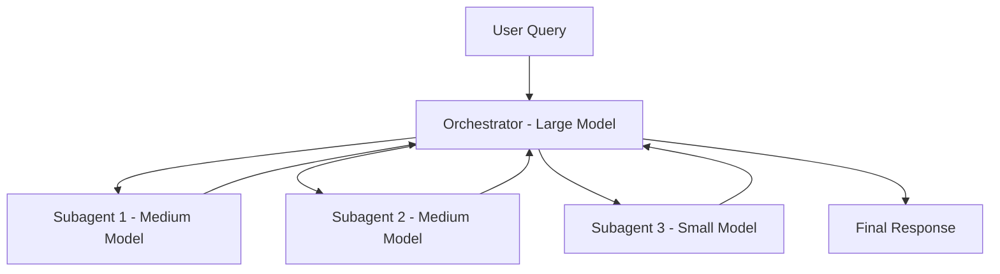

# Concept: Multi-Agent Patterns

This document outlines best practices for building effective multi-agent systems with AI coding assistants.

## The Orchestrator-Worker Pattern

The most effective architecture uses a lead agent (orchestrator) coordinating specialized subagents (workers).



### Performance Impact

- Multi-agent systems outperform single-agent by up to 90% on complex research tasks
- Token usage explains 80% of performance variance
- Parallel execution reduces research time by up to 90%

## Model Selection for Agents

### Three-Tier Architecture

| Tier | Role | Model Size | Context Budget |
|------|------|------------|----------------|
| Strategic | Orchestrator, planning | Large | Full context |
| Tactical | Implementation, analysis | Medium | 10-15k tokens |
| Operational | Verification, simple tasks | Small | Under 3k tokens |

### Cost-Performance Trade-offs

- **Small models**: ~90% of medium model performance at 2x speed, 3x cost savings
- **Medium models**: Optimal for most coding tasks
- **Large models**: Reserved for strategic decisions and complex reasoning

## Task Decomposition

### Subagent Requirements

Each subagent needs:

1. **Objective**: Clear, specific goal
2. **Output Format**: Expected structure of results
3. **Tool Guidance**: Which tools and sources to use
4. **Task Boundaries**: What is explicitly out of scope

### Scaling Guidelines

| Task Complexity | Subagents | Tool Calls Each |
|-----------------|-----------|-----------------|
| Simple fact-finding | 1 | 3-10 |
| Direct comparisons | 2-4 | 10-15 |
| Complex research | 10+ | Varies |

## Context Isolation

### The Golden Rule

Let the orchestrator maintain the global plan and compact state, not every detail.

### Implementation

1. **Orchestrator Context**: Strategic plan, success criteria, coordination state
2. **Subagent Context**: Task-specific information, tool results, local state
3. **Shared Context**: Project standards via AI config files, memory-bank documents

## Parallel Development Patterns

### Code-Review Separation

```text
Agent A: Write implementation code
Agent B: Review and test (parallel)
```

### Git Worktree Pattern

For truly independent tasks:

```bash
# Create isolated working directories
git worktree add ../feature-auth feat/auth
git worktree add ../feature-ui feat/ui

# Run separate AI agent instances in each directory
```

### Multi-Agent Workflows

1. One agent writes code
2. Another agent reviews/tests
3. Results merged by orchestrator

## Test-Driven Development with Subagents

### The Pattern

1. **Testing Subagent**: Write failing tests first
2. Run tests, confirm failures
3. **Implementer Subagent**: Make tests pass (cannot modify tests)
4. **Review Subagent**: Enforce linting, complexity, security

### Anti-Patterns to Avoid

- Modifying tests to make them pass
- Skipping verification steps
- Allowing subagents to exceed their scope

## Security Considerations

### Permission Model

- Use deny-all baseline
- Allowlists per subagent
- Confirmations for sensitive actions

### MCP Security

When exposing tools via MCP:

- OAuth 2.1-style authentication
- TLS for all connections
- Sandboxing for execution
- Scoped permissions per tool
- Comprehensive logging

## Error Handling

### Stateful Recovery

- Implement checkpoints for long-running tasks
- Resume from last successful checkpoint on failure
- Document failure reasons for retry attempts

### The Failure Cycle

Per the [5-step workflow](../workflows/4-implement-and-verify.md):

1. If implementation fails repeatedly, document the failure
2. Restart from Step 1 with new information
3. Never suppress errors to make tests pass

## Integration with Memory Bank

Multi-agent systems benefit from the [Memory Bank](./memory-bank/README.md):

- **active-context.md**: Current orchestrator state
- **progress-tracking.md**: Subagent completion status
- **system-patterns.md**: Shared architectural decisions

## Production Observability

### Monitoring Considerations

- Track decision patterns across agents
- Monitor token usage per subagent tier
- Log tool invocation patterns
- Measure task completion rates

### Deployment Strategy

Use gradual rollouts to avoid disrupting active agent sessions.
