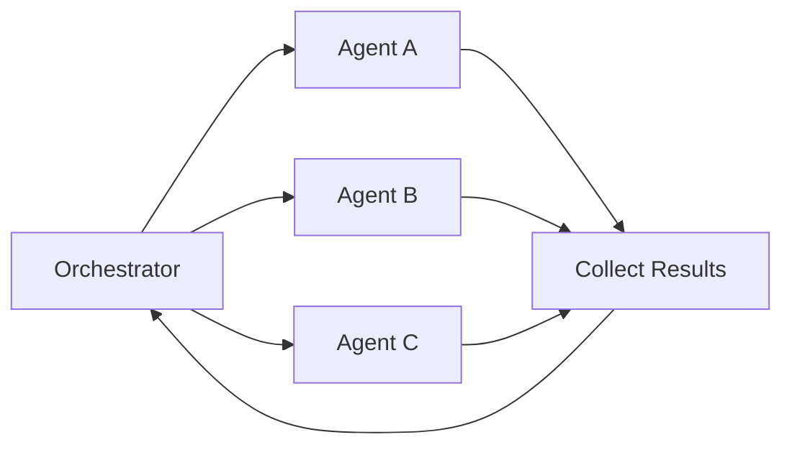
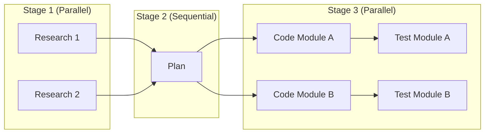

# Concept: Parallelism in AI Operations

Parallelism is a force multiplier. Every operation that CAN run in parallel SHOULD run in parallel.

## The Golden Rule

> If two operations don't depend on each other, run them simultaneously.

## Where to Apply Parallelism

### 1. Tool Calls

**Always** batch independent tool calls in a single message:

```text
BAD (Sequential):
  Message 1: Read file A
  Message 2: Read file B
  Message 3: Read file C

GOOD (Parallel):
  Message 1: Read file A, Read file B, Read file C
```

### 2. Subagent Execution

Spawn independent subagents simultaneously:

```text
BAD:
  1. Web Researcher finds info
  2. Wait...
  3. Doc Reviewer checks docs
  4. Wait...
  5. Security Auditor reviews

GOOD:
  1. Spawn all three in parallel
  2. Collect results
  3. Proceed
```

### 3. Git Worktrees

For independent features:

```bash
# Create parallel workspaces
git worktree add ../feat-auth feat/auth
git worktree add ../feat-ui feat/ui

# Run agents in each simultaneously
```

### 4. Research Queries

Launch multiple search queries at once:

```text
BAD:
  Search 1: "TypeScript patterns"
  Wait for results...
  Search 2: "Error handling"
  Wait for results...

GOOD:
  Search 1, 2, 3: All queries simultaneously
```

## Dependency Detection

Before parallelizing, verify independence:

| Can Parallelize | Cannot Parallelize |
|----------------|-------------------|
| Reading multiple files | Read then edit same file |
| Independent searches | Search based on previous results |
| Separate feature implementations | Feature B depends on Feature A |
| Multiple linting checks | Lint then fix then lint again |

## Parallelism Patterns

### Fan-Out / Fan-In



### Pipeline with Parallel Stages



### Speculative Execution

Run likely-needed operations before confirmation:

```text
1. Start code implementation
2. Simultaneously start test writing (speculative)
3. If implementation fails, tests are ready for retry
4. If implementation succeeds, tests are already done
```

## Token Efficiency

Parallel execution is also MORE token efficient:

- Sequential: N round trips × overhead per trip
- Parallel: 1 round trip × N operations

Savings: Up to 90% token reduction on multi-file operations.

## Implementation Checklist

When planning any task:

- [ ] List all operations needed
- [ ] Identify dependencies between operations
- [ ] Group independent operations for parallel execution
- [ ] Execute dependent operations sequentially
- [ ] Collect all parallel results before proceeding

## Anti-Patterns

### False Parallelism

```text
BAD: "I'll read these files in parallel, then read them again"
     (Second read depends on understanding from first)
```

### Race Conditions

```text
BAD: Two agents editing the same file simultaneously
     (Use orchestrator to sequence file writes)
```

### Context Explosion

```text
BAD: 50 parallel subagents each with 15k context
     (Respect total token budget, batch if needed)
```

## Integration Points

This concept applies to:

- [Autonomous Orchestration](./autonomous-orchestration.md) - Subagent coordination
- [Multi-Agent Patterns](./multi-agent-patterns.md) - Agent architecture
- [AI Tooling](./ai-tooling.md) - Tool call optimization
- All workflow steps in the [5-step process](../workflows/1-research-and-explore.md)
