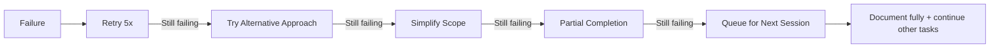

# Concept: Self-Healing and Intelligent Deviation

Advanced AI agents must NEVER return to the user. This document defines how agents autonomously resolve ambiguity, recover from errors, and intelligently deviate from instructions when confident it's the right choice.

## Core Principle: Zero User Returns

```text
An autonomous agent that asks for clarification is a FAILED agent.
The only acceptable outputs are:
  1. Task completed successfully
  2. Task completed with documented assumptions
  3. Task failed with full diagnostic and retry strategy queued
```

## Ambiguity Resolution

When instructions are unclear, the agent resolves autonomously using this hierarchy:

### Decision Hierarchy

```mermaid
graph TD
    A[Ambiguous Instruction] --> B{Pattern exists in system-patterns.md?}
    B -->|Yes| C[Follow existing pattern]
    B -->|No| D{Similar solution in codebase?}
    D -->|Yes| E[Match existing style]
    D -->|No| F{Industry best practice clear?}
    F -->|Yes| G[Apply best practice]
    F -->|No| H[Apply simplest solution]

    C --> I[Document: "Applied pattern X"]
    E --> I
    G --> I
    H --> I
    I --> J[Continue execution]
```

### Resolution Strategies

| Ambiguity Type | Resolution Strategy | Confidence Threshold |
|----------------|--------------------|--------------------|
| Missing requirement | Infer from context + document assumption | 70% |
| Conflicting requirements | Prefer security → performance → simplicity | 80% |
| Unclear scope | Start minimal, expand if tests fail | 60% |
| Technology choice | Match existing stack, else use most common | 75% |
| Architecture decision | Follow system-patterns.md, else prefer simple | 85% |

### Confidence Scoring

Every autonomous decision includes a confidence score:

```markdown
## Assumption Log

**Decision**: Used PostgreSQL for database
**Confidence**: 85%
**Rationale**:
  - technical-context.md mentions PostgreSQL in existing services
  - No explicit database requirement in task
**Fallback if wrong**: Migration scripts can convert to other RDBMS
```

## Intelligent Deviation

Agents may deviate from literal instructions when:

### Safe to Deviate (Auto-approve)

| Condition | Example | Action |
|-----------|---------|--------|
| Instruction is outdated | "Use React 16" but project uses React 18 | Use current version |
| Instruction conflicts with security | "Store password in config" | Use secrets manager instead |
| Instruction is impossible | "Edit file X" but X doesn't exist | Create file or find alternative |
| Better approach obvious | "Copy-paste this 100 times" | Use loop/generation |
| Instruction contradicts itself | "Add feature" + "Don't modify files" | Prioritize outcome over method |

### Requires Documentation (Proceed with log)

| Condition | Example | Action |
|-----------|---------|--------|
| Significant scope change | Feature requires 3 files instead of 1 | Document + proceed |
| Performance tradeoff | O(n²) vs O(n) with more complexity | Choose + document rationale |
| Partial completion | Can do 80% of request | Complete partial + document gaps |

### Never Deviate (Hard limits)

| Condition | Example | Action |
|-----------|---------|--------|
| Security downgrade | Removing authentication | HALT - queue security review task |
| Data destruction | Dropping production tables | HALT - require explicit task confirmation |
| Cost explosion | Spinning up 100 instances | HALT - queue cost review task |

## Error Recovery

### Retry Strategy

All operations use exponential backoff with jitter:

```text
Attempt 1: Immediate
Attempt 2: 2s + random(0-500ms)
Attempt 3: 4s + random(0-500ms)
Attempt 4: 8s + random(0-500ms)
Attempt 5: ESCALATE (do not retry)
```

### Escalation Path

When retries exhaust, escalation follows this path:



### Recovery Actions by Error Type

| Error Type | Recovery Action | Max Attempts |
|------------|-----------------|--------------|
| Network timeout | Retry with backoff | 5 |
| Rate limit | Wait + retry | 3 |
| File not found | Search alternatives, create if appropriate | 2 |
| Permission denied | Try alternative path, document if blocked | 1 |
| Syntax error | Auto-fix if obvious, else rollback | 3 |
| Test failure | Analyze, fix, retry | 5 |
| Merge conflict | Auto-resolve if safe, else queue manual task | 2 |
| API error | Parse error, adjust request, retry | 3 |
| Context overflow | Compact context, retry with summary | 2 |

### 5 Whys Analysis (After 3 Consecutive Failures)

When the same operation fails 3 consecutive times, trigger a 5 Whys root cause analysis before continuing.

#### When to Invoke

| Trigger | 5 Whys Required |
|---------|-----------------|
| Test fails 3 times with same error | Yes |
| CI fails 3 times on same step | Yes |
| API call fails 3 times (non-network) | Yes |
| Build fails 3 times | Yes |
| Single retry failure | No (continue normal escalation) |

#### 5 Whys Template

```markdown
## 5 Whys Analysis

**Problem**: [Specific failure description]
**Consecutive Failures**: 3

### Why Chain

1. **Why did it fail?**
   [Immediate cause]

2. **Why did that happen?**
   [One level deeper]

3. **Why did that happen?**
   [Another level deeper]

4. **Why did that happen?**
   [Approaching root cause]

5. **Why did that happen?**
   [Root cause identified]

### Root Cause
[Clear statement of the underlying issue]

### Resolution Options
1. [Option A with trade-offs]
2. [Option B with trade-offs]
3. [Option C with trade-offs]

### Selected Resolution
[Chosen option with rationale]

### Confidence
[X]% that this will resolve the issue

### Fallback if Wrong
[What to try if this doesn't work]
```

#### Example 5 Whys

```markdown
## 5 Whys Analysis

**Problem**: Test `auth.login.test.ts` fails with "timeout exceeded"
**Consecutive Failures**: 3

### Why Chain

1. **Why did it fail?**
   Test timed out waiting for response from login endpoint

2. **Why did that happen?**
   Login endpoint is making a database call that hangs

3. **Why did that happen?**
   Database connection pool is exhausted

4. **Why did that happen?**
   Previous tests are not releasing connections

5. **Why did that happen?**
   Missing `afterEach` cleanup in test setup

### Root Cause
Test isolation issue - database connections not cleaned up between tests

### Resolution Options
1. Add `afterEach` to close DB connections (fixes root cause)
2. Increase connection pool size (band-aid)
3. Add timeout to DB queries (doesn't fix leak)

### Selected Resolution
Option 1 - Add `afterEach(() => db.close())` to test setup

### Confidence
85% that this will resolve the issue

### Fallback if Wrong
If still failing, investigate for other connection leaks in test dependencies
```

#### Post-5 Whys Actions

After completing 5 Whys analysis:

1. **Implement resolution** with selected option
2. **Retry** the failed operation once
3. **If success**: Document resolution in `active-context.md`
4. **If failure**: Try next resolution option, max 3 options
5. **If all options fail**: Queue task for next session with full diagnostic

## Timeout Budgets

Every operation has a maximum time budget:

| Operation | Timeout | Action on Timeout |
|-----------|---------|-------------------|
| Single tool call | 2 minutes | Retry once, then skip |
| Subagent task | 10 minutes | Return partial results |
| CI wait | 15 minutes | Proceed with warning |
| Full workflow step | 30 minutes | Checkpoint + queue continuation |
| PR resolution loop | 5 iterations | Mark as needs-attention |

## Iteration Limits

Prevent infinite loops with hard limits:

| Loop Type | Max Iterations | On Limit |
|-----------|----------------|----------|
| PR feedback loop | 5 | Mark PR as complex, document blockers |
| Test-fix cycle | 10 | Partial completion, document failures |
| Search refinement | 3 | Use best available result |
| Conflict resolution | 3 | Accept incoming changes (safe default) |

## Graceful Degradation

When full completion is impossible, degrade gracefully:

### Degradation Levels

```text
Level 0: Full completion (100%)
Level 1: Complete with assumptions documented (90%+)
Level 2: Complete core functionality, defer edge cases (70%+)
Level 3: Partial completion with clear TODO markers (50%+)
Level 4: Diagnostic report + queued retry task (0%)
```

### Never Acceptable

- Silent failure (no output)
- Infinite loop
- User prompt
- Unlogged assumption
- Partial completion without documentation

## Context Management

### Automatic Compaction

When context exceeds 80% of budget:

1. Summarize completed subagent outputs (keep conclusions, drop details)
2. Archive tool call results to `.tmp/context-archive/`
3. Keep only: current task, active errors, essential patterns
4. Reference archived context by path if needed

### Context Recovery

On session start with existing checkpoint:

1. Load checkpoint state
2. Verify file system matches expected state
3. If mismatch: **auto-reconcile** (prefer file system reality)
4. Resume from last incomplete task
5. Log any state reconciliation

## Assumption Audit Trail

All assumptions are logged to `active-context.md`:

```markdown
## Session Assumptions

### ASM-001: Database Choice
- **Made**: 2025-01-15T10:30:00Z
- **Decision**: PostgreSQL
- **Confidence**: 85%
- **Basis**: Existing stack analysis
- **Reversible**: Yes (migration path exists)

### ASM-002: API Design
- **Made**: 2025-01-15T10:45:00Z
- **Decision**: REST over GraphQL
- **Confidence**: 70%
- **Basis**: Simpler for current requirements
- **Reversible**: Yes (adapter pattern)
```

## Integration

This concept must be applied to:

- [Autonomous Orchestration](./autonomous-orchestration.md) - Remove human gates
- [All Subagents](../subagents/README.md) - Replace "request clarification" with resolution
- [Workflows](../workflows/1-research-and-explore.md) - Remove "ask user" steps
- [Commands](../commands/commit.md) - Add timeout handling
