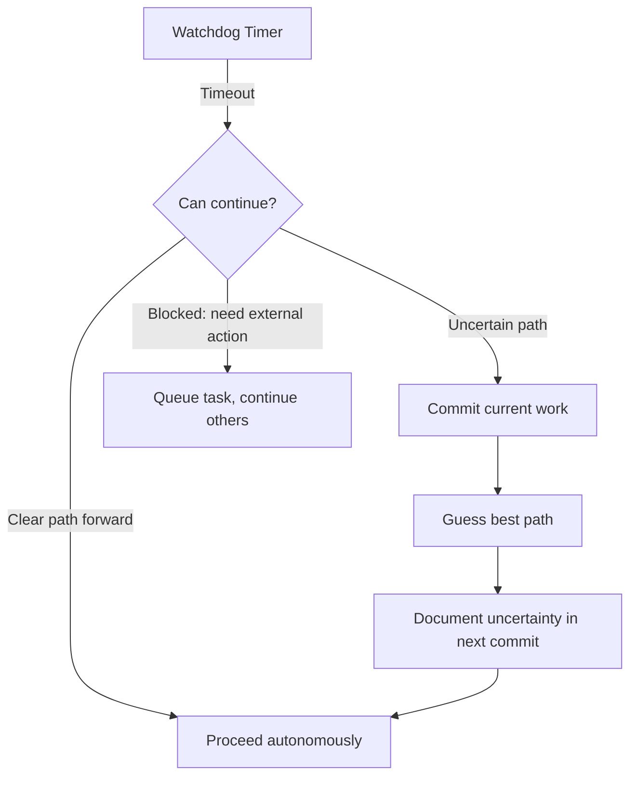

# Concept: User Presence Modes

This document defines the three operational modes for AI agents based on user availability.

## Mode Overview

| Mode | User Available | Interaction Level | Use Case |
|------|---------------|-------------------|----------|
| `attended` | Yes, actively present | Full interaction during Planning | Pair programming, code review |
| `semi-attended` | Occasionally checking | Notifications only | Background work with periodic check-ins |
| `unattended` | No, running overnight | Zero interaction | Autonomous overnight runs |

## Mode Definitions

### Attended Mode (Default)

User is actively present and engaged with the AI session.

**Behavior:**
- **Research**: May ask clarifying questions at session START only
- **Planning**: Fully interactive - iterate with user until alignment
- **Coding/Testing**: Zero user interaction
- **Completion**: Report results, wait for next task

**Transition to Coding:** User executes `/start-implementation` slash command

**Watchdog:** Disabled (user is present)

### Semi-Attended Mode

User is monitoring but not actively engaged. AI should proceed autonomously but flag important decisions.

**Behavior:**
- **Research**: No clarifying questions - resolve autonomously
- **Planning**: Create PRD autonomously, present for brief review
- **Coding/Testing**: Zero user interaction
- **Completion**: Commit, push, create PR, notify user

**Transition to Coding:** Automatic after PRD creation (2 minute grace period)

**Watchdog:** Enabled - 15 minute timeout, then auto-continue

### Unattended Mode

AI is running overnight or without any user oversight.

**Behavior:**
- **Research**: Resolve all ambiguity autonomously per [Self-Healing](./self-healing.md)
- **Planning**: Create PRD autonomously, no user review
- **Coding/Testing**: Zero user interaction
- **Completion**: Commit, push, create PR, queue next task

**Transition:** All transitions automatic based on completion criteria

**Watchdog:** Enabled - aggressive (5 minute timeout)

## Setting the Mode

### Via Environment Variable (Primary)

The AI sets and reads the `AI_USER_PRESENT` environment variable:

```bash
# Set by AI at session start
export AI_USER_PRESENT=true    # attended or semi-attended
export AI_USER_PRESENT=false   # unattended
export AI_SESSION_MODE=attended|semi-attended|unattended
```

**Watchdog Auto-Detection:**
When the 15-minute timeout triggers:
1. AI prompts user for guidance
2. If no response within 2 minutes → set `AI_USER_PRESENT=false`
3. Restart session in unattended mode
4. Continue autonomously

### Via Prompt Files (Recommended for Unattended)

Place mode setting in project root prompt file:

```markdown
# Task: Implement Feature X

## Mode
unattended

## Instructions
...
```

### Via Initial Session Message

```text
User: Run in unattended mode and implement the tasks in prompt.md
```

### Default Behavior

If no mode is specified:
- Single task → `attended` (AI_USER_PRESENT=true)
- Batch of tasks → `semi-attended` (AI_USER_PRESENT=true)
- Overnight run explicitly mentioned → `unattended` (AI_USER_PRESENT=false)
- 15-min timeout with no response → auto-switch to `unattended`

## Watchdog Mechanism

The watchdog monitors agent activity and prevents indefinite blocking.

### Watchdog Rules



### Timeout Durations by Mode

| Mode | Planning Timeout | Coding Timeout | Blocked Timeout |
|------|------------------|----------------|-----------------|
| attended | ∞ (disabled) | N/A | N/A |
| semi-attended | 15 min | 30 min | 10 min |
| unattended | 5 min | 15 min | 5 min |

### Commit-Before-Guessing Pattern

When the watchdog triggers and the path forward is uncertain:

1. **Commit** all current valid work with message:
   ```
   checkpoint: work before uncertain decision

   About to make uncertain decision about [X].
   Confidence: [Y]%
   Alternatives considered: [list]
   ```

2. **Proceed** with best guess

3. **Document** uncertainty in next commit:
   ```
   feat(scope): description

   UNCERTAINTY: Guessed [decision] because [reason].
   If wrong, revert to [commit hash] and try [alternative].
   ```

4. **Continue** execution

### Watchdog Self-Monitoring

The watchdog tracks:
- Time since last progress (file change, commit, API call)
- Iteration count for loops (PR feedback, test-fix cycles)
- Context utilization percentage

When thresholds are exceeded:
1. Log current state to `active-context.md`
2. Attempt checkpoint commit
3. Make autonomous decision per [Self-Healing](./self-healing.md)
4. Resume execution

## Phase-Specific Behavior

### Research Phase

| Mode | Clarifying Questions | Ambiguity Resolution |
|------|---------------------|---------------------|
| attended | Allowed at session START only | Ask first, then autonomous |
| semi-attended | Not allowed | Autonomous |
| unattended | Not allowed | Autonomous |

### Planning Phase

| Mode | User Iteration | PRD Approval |
|------|---------------|--------------|
| attended | Full back-and-forth until `/start-implementation` | Explicit user approval |
| semi-attended | None, auto-generate | 2 min grace period for objection |
| unattended | None, auto-generate | None required |

### Coding Phase

All modes: Zero user interaction. Trust the PRD.

### Commit/Push Phase

| Mode | Pre-commit Hooks | PR Creation |
|------|-----------------|-------------|
| attended | Must pass (NEVER skip) | Automatic |
| semi-attended | Must pass (NEVER skip) | Automatic + notify |
| unattended | Must pass (NEVER skip) | Automatic + queue next |

## Hard Protections (All Modes)

These protections apply regardless of mode:

### NEVER Do

- Skip pre-commit hooks (`--no-verify`)
- Disable GitHub Actions workflows
- Remove existing tests (only add)
- Force push to protected branches
- Merge without passing CI
- Suppress linter errors

### ALWAYS Do

- Run full test suite before commit
- Run linters before commit
- Create meaningful commit messages
- Document assumptions
- Update progress tracking

## Integration

### With Slash Commands

Mode-aware slash commands:

| Command | Attended | Semi-Attended | Unattended |
|---------|----------|---------------|------------|
| `/research-complete` | Triggers planning discussion | Auto-proceeds | Auto-proceeds |
| `/start-implementation` | Locks PRD, starts coding | N/A (auto) | N/A (auto) |
| `/pause` | Saves checkpoint | Saves checkpoint | Saves checkpoint |
| `/resume` | Loads checkpoint | Loads checkpoint | Loads checkpoint |

### With Self-Healing

In `unattended` mode, [Self-Healing](./self-healing.md) is the primary decision-making mechanism:
- All ambiguity resolved via decision hierarchy
- All errors recovered via escalation path
- All timeouts handled via graceful degradation

### With Autonomous Orchestration

[Autonomous Orchestration](./autonomous-orchestration.md) uses mode to determine:
- Whether to wait for user input
- How aggressively to timeout
- Whether to auto-continue after completion
