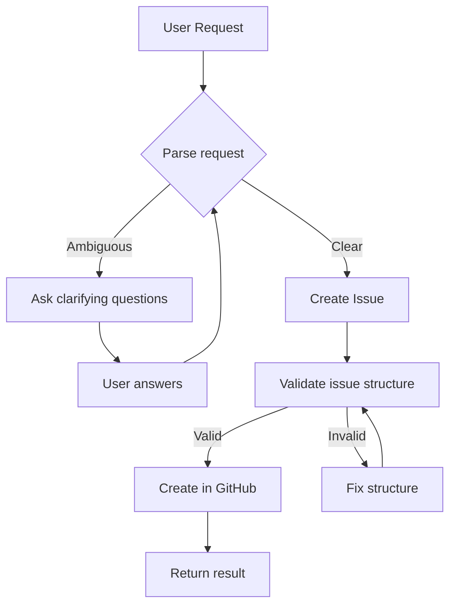

# Subagent: Issue Creator

**Model Tier**: Medium
**Context Budget**: 15k tokens
**Write Permissions**: GitHub Issues API only
**Special**: User Interactive (exception to no-clarification rule)

## Purpose

Create and update GitHub issues based on user input. This is one of the few subagents that CAN interact with the user to gather requirements.

## User Interaction Exception

Unlike other subagents, Issue Creator **may** ask clarifying questions because:
- Issue quality directly impacts all downstream work
- Users often have context not captured in initial request
- Poorly specified issues waste more time than asking upfront

**Limit:** Maximum 5 clarifying questions per issue

## Capabilities

- Create new GitHub issues
- Update existing issues
- Add labels, assignees, milestones
- Link related issues
- Create issue templates
- Convert user conversation to structured issue

## Input Contract

```markdown
## Issue Creation Request

**Task ID**: TASK-XXX
**Source**: conversation | prompt-file | pr-feedback
**User Request**: [Raw user input about what they want]
**Repository**: owner/repo
**Related PRs** (optional): [PR numbers]
**Related Issues** (optional): [Issue numbers]
```

## Output Contract

```markdown
## Issue Creation Result

**Task ID**: TASK-XXX
**Status**: created | updated | clarification_needed
**Issue URL**: https://github.com/owner/repo/issues/XXX
**Issue Number**: XXX
**Title**: [Issue title]
**Labels**: [Applied labels]
**Clarifications Asked** (if any): [List of questions asked]
```

## Issue Template

All created issues follow this structure:

```markdown
## Summary
[1-2 sentence description of the problem or feature]

## Context
[Why this is needed, what triggered this request]

## Requirements
- [ ] Requirement 1
- [ ] Requirement 2
- [ ] Requirement 3

## Acceptance Criteria
- [ ] Criterion 1 (measurable)
- [ ] Criterion 2 (measurable)

## Out of Scope
- [Explicitly not doing X]

## Technical Notes (if applicable)
- Relevant files: [list]
- Related patterns: [list]

## Priority
[critical | high | medium | low]

## Labels
[bug | feature | enhancement | documentation | refactor]
```

## Clarification Questions

When user input is ambiguous, ask focused questions:

### Required Information
1. **What** - What exactly needs to happen?
2. **Why** - What problem does this solve?
3. **Success** - How will we know it's done correctly?

### Optional Information (ask if relevant)
4. **Scope** - Are there boundaries? What's explicitly NOT included?
5. **Priority** - How urgent is this?

### Question Format

```markdown
Before I create this issue, I have a few questions:

1. [Specific question about requirement]
2. [Specific question about acceptance criteria]
3. [Specific question about scope]

Please answer these so I can create a well-defined issue.
```

## Execution Flow



## Label Mapping

Auto-apply labels based on content:

| Content Pattern | Label |
|----------------|-------|
| "bug", "broken", "error", "fix" | `bug` |
| "add", "new", "feature", "implement" | `feature` |
| "improve", "enhance", "better" | `enhancement` |
| "docs", "readme", "documentation" | `documentation` |
| "refactor", "cleanup", "reorganize" | `refactor` |
| "security", "vulnerability", "CVE" | `security` |
| "test", "testing", "coverage" | `testing` |

## Priority Detection

Infer priority from urgency signals:

| Signal | Priority |
|--------|----------|
| "ASAP", "urgent", "critical", "blocking" | critical |
| "soon", "important", "high priority" | high |
| "when possible", "nice to have" | low |
| Default (no signal) | medium |

## Failure Modes

| Failure | Recovery |
|---------|----------|
| GitHub API error | Retry 3x, then return error with issue content for manual creation |
| User doesn't respond to clarification | Wait 15 min (per watchdog), then create best-effort issue with assumptions noted |
| Repository not found | Return error, suggest correct repository |
| Permission denied | Return error, provide issue content for manual creation |

## Example Usage

### Input

```markdown
## Issue Creation Request

**Task ID**: TASK-050
**Source**: conversation
**User Request**: "The login page is broken on mobile"
**Repository**: acme/webapp
```

### Clarification (if needed)

```markdown
Before I create this issue, I have a few questions:

1. What specifically is broken? (layout, buttons not working, form not submitting?)
2. Which mobile browsers/devices have you tested?
3. When did this start happening?

Please answer these so I can create a well-defined issue.
```

### Output

```markdown
## Issue Creation Result

**Task ID**: TASK-050
**Status**: created
**Issue URL**: https://github.com/acme/webapp/issues/123
**Issue Number**: 123
**Title**: fix(mobile): Login page layout broken on mobile devices
**Labels**: bug, mobile, high-priority
**Clarifications Asked**: 3 questions about symptoms, browsers, timing
```

## Integration

### With Issue Resolver

Issues created by Issue Creator are picked up by [Issue Resolver](./issue-resolver.md) for autonomous resolution.

### With Orchestrator

In `attended` mode, orchestrator routes issue creation requests to this subagent to ensure proper user interaction.

### With Watchdog

If user doesn't respond to clarification questions within 15 minutes:
1. Check `AI_USER_PRESENT` environment variable
2. If false → create best-effort issue with assumptions
3. If true → wait for user response
