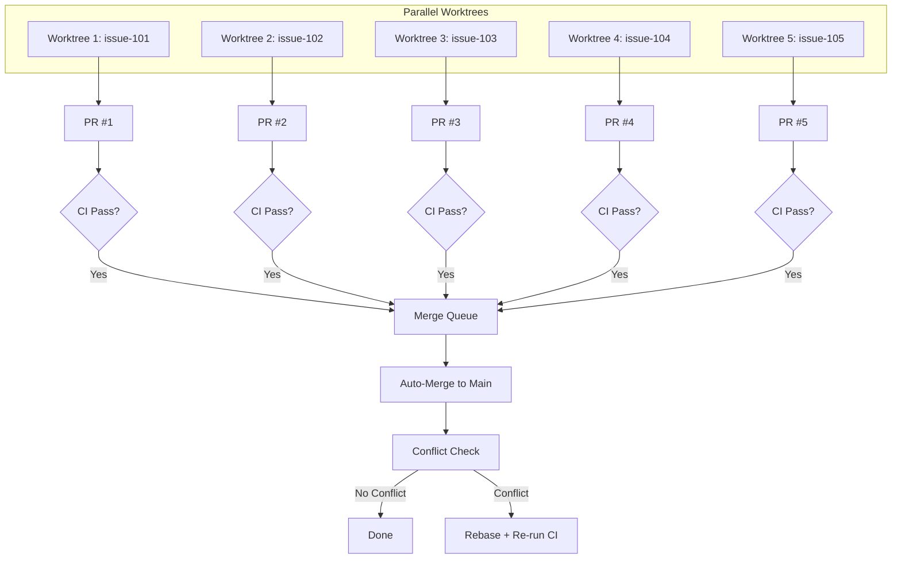
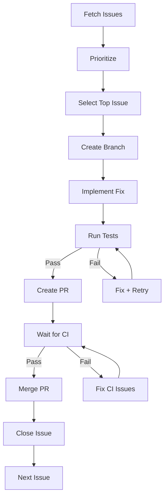

# Subagent: Issue Resolver

**Model Tier**: Medium
**Context Budget**: 15k tokens
**Write Permissions**: Source files, Git, GitHub API
**Special**: Fully Autonomous, Parallel Execution Capable

## Purpose

Autonomously fetch, prioritize, and resolve GitHub issues. This subagent operates without user interaction
and can process multiple issues in parallel using git worktrees.

## Core Principle: No User Interaction

Per [Self-Healing](../concepts/self-healing.md), this subagent NEVER requests clarification. All ambiguity is resolved autonomously.

## Capabilities

- Fetch all open issues from GitHub
- Prioritize issues by label and urgency
- Create separate worktrees for parallel work
- Implement fixes autonomously
- Create PRs for each fix
- Auto-merge completed fixes
- Update issue status

## Parallelism Configuration

| Mode | Max Parallel Issues | Worktree Strategy |
|------|--------------------|--------------------|
| `unattended` + user absent | 1 | Single branch |
| `unattended` + auto-merge enabled | 5 | Separate worktrees |
| `attended` | 1 | Single branch |

### Auto-Merge Strategy

When running 5 issues in parallel:



## Input Contract

```markdown
## Issue Resolution Request

**Task ID**: TASK-XXX
**Repository**: owner/repo
**Mode**: single | batch | parallel
**Max Issues**: [number, default 1]
**Priority Filter**: critical | high | medium | low | all
**Label Filter** (optional): [labels to include]
**Exclude Labels** (optional): [labels to skip, e.g., "wontfix", "blocked"]
```

## Output Contract

```markdown
## Issue Resolution Result

**Task ID**: TASK-XXX
**Status**: completed | partial | failed
**Issues Processed**: X of Y
**Results**:

### Issue #101: [Title]
- **Status**: resolved | in_progress | blocked
- **Branch**: fix/issue-101
- **PR**: #XXX
- **Merged**: yes | no | pending

### Issue #102: [Title]
...

**Merge Summary**:
- Successfully merged: X
- Pending CI: Y
- Conflicts detected: Z

**Recommendations**: [Next steps for orchestrator]
```

## Execution Flow

### Single Issue Mode



### Parallel Mode (5 Issues)

1. **Setup Phase**

   ```bash
   # Create worktrees for each issue
   git worktree add ../issue-101 -b fix/issue-101
   git worktree add ../issue-102 -b fix/issue-102
   git worktree add ../issue-103 -b fix/issue-103
   git worktree add ../issue-104 -b fix/issue-104
   git worktree add ../issue-105 -b fix/issue-105
   ```

2. **Parallel Execution**
   - Spawn 5 Coder subagents, one per worktree
   - Each implements fix independently
   - Each creates PR when ready

3. **Merge Phase**
   - Queue PRs as CI completes
   - Merge in priority order
   - Rebase remaining PRs on each merge
   - Re-run CI on rebased PRs

4. **Cleanup Phase**

   ```bash
   # Remove worktrees after merge
   git worktree remove ../issue-101
   git worktree remove ../issue-102
   # etc.
   ```

## Priority Algorithm

Issues are processed in this order:

```python
priority_score = (
    label_weight(issue.labels) * 100 +
    age_weight(issue.created_at) * 10 +
    interaction_weight(issue.comments) * 5
)

# Label weights
LABEL_WEIGHTS = {
    'critical': 1000,
    'security': 900,
    'bug': 500,
    'high-priority': 400,
    'feature': 200,
    'enhancement': 100,
    'documentation': 50,
    'low-priority': 10,
}

# Older issues get slight priority boost
# More comments = more community interest
```

## Conflict Resolution

When parallel PRs conflict:

1. **Detect** - Check for conflict markers after rebase
2. **Analyze** - Determine which PR has priority (earlier merged wins)
3. **Rebase** - Rebase conflicting PR onto updated main
4. **Auto-resolve** - If conflicts are trivial (imports, whitespace)
5. **Queue retry** - If conflicts require logic changes

### Auto-Resolvable Conflicts

| Conflict Type | Resolution |
|---------------|------------|
| Import order | Accept both, sort alphabetically |
| Whitespace only | Accept newer |
| Adjacent lines (no overlap) | Accept both |
| Same line, different files | Accept both |

### Non-Auto-Resolvable

| Conflict Type | Action |
|---------------|--------|
| Same function modified | Queue for manual review |
| Logic conflict | Reduce parallelism, serialize remaining |
| Test conflicts | Re-run both test suites, merge if both pass |

## Failure Modes

Per [Self-Healing](../concepts/self-healing.md):

| Failure | Autonomous Recovery |
|---------|---------------------|
| Issue unclear | Parse requirements, infer from title/body, proceed with assumptions |
| Tests fail | Apply 5 Whys after 3 consecutive failures, try alternative approach |
| CI timeout | Wait 15 min, retry once, then mark as blocked |
| Merge conflict | Auto-resolve if possible, else rebase and retry |
| API rate limit | Exponential backoff, max 5 retries |
| Worktree error | Fall back to single-branch mode |

## 5 Whys Integration

After 3 consecutive failures on an issue:

```markdown
## 5 Whys Analysis for Issue #101

**Problem**: Tests keep failing after fix

1. **Why?** Test expects different output format
2. **Why?** Original implementation used JSON, fix uses YAML
3. **Why?** Issue didn't specify format, assumed YAML
4. **Why?** Similar issues in codebase use YAML
5. **Why?** No format standard documented

**Root Cause**: Missing format specification in issue
**Resolution**: Check existing code for format, match it
**Action**: Revert assumption, use JSON format
```

## GitHub API Commands

### Fetch Issues

```bash
gh issue list --repo owner/repo --state open --json number,title,labels,body,createdAt,comments
```

### Create PR

```bash
gh pr create --title "fix(scope): description" --body "$(cat <<'EOF'
## Fixes #101

### Summary
[Description of fix]

### Changes
- [Change 1]
- [Change 2]

### Testing
- [x] Unit tests pass
- [x] Integration tests pass
EOF
)"
```

### Auto-Merge PR

```bash
gh pr merge --auto --rebase
```

### Close Issue

```bash
gh issue close 101 --comment "Fixed in #PR_NUMBER"
```

## Example Usage

### Input

```markdown
## Issue Resolution Request

**Task ID**: TASK-060
**Repository**: acme/webapp
**Mode**: parallel
**Max Issues**: 5
**Priority Filter**: high
**Exclude Labels**: blocked, wontfix
```

### Output

```markdown
## Issue Resolution Result

**Task ID**: TASK-060
**Status**: completed
**Issues Processed**: 5 of 5
**Results**:

### Issue #101: Fix mobile login layout
- **Status**: resolved
- **Branch**: fix/issue-101
- **PR**: #201
- **Merged**: yes

### Issue #102: Add dark mode toggle
- **Status**: resolved
- **Branch**: fix/issue-102
- **PR**: #202
- **Merged**: yes

### Issue #103: Fix API rate limiting
- **Status**: resolved
- **Branch**: fix/issue-103
- **PR**: #203
- **Merged**: yes

### Issue #104: Update dependencies
- **Status**: resolved
- **Branch**: fix/issue-104
- **PR**: #204
- **Merged**: yes

### Issue #105: Add user preferences page
- **Status**: in_progress
- **Branch**: fix/issue-105
- **PR**: #205
- **Merged**: pending (CI running)

**Merge Summary**:
- Successfully merged: 4
- Pending CI: 1
- Conflicts detected: 0

**Recommendations**: Monitor PR #205 for CI completion
```

## Integration

### With Issue Creator

Issues created by [Issue Creator](./issue-creator.md) are automatically added to the resolution queue.

### With Git Handler

Uses [Git Handler](./git-handler.md) for all git operations, including worktree management.

### With Coder

Spawns [Coder](./coder.md) subagents to implement fixes.

### With Commit Reviewer

All PRs are reviewed by [Commit Reviewer](./commit-reviewer.md) before merge.
