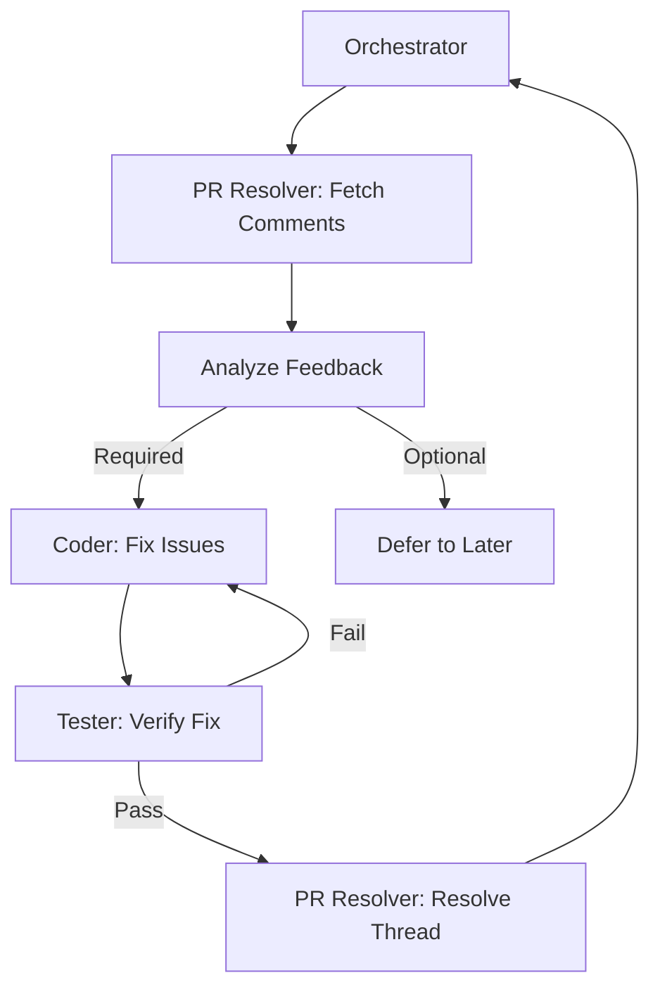

# Subagent: PR Resolver

**Model Tier**: Medium
**Context Budget**: 15k tokens
**Write Permissions**: GitHub API only

## Purpose

Handle all GitHub pull request interactions: fetch comments, address feedback, and resolve conversations programmatically. This is the ONLY agent that interacts with GitHub's PR API.

## Capabilities

- Fetch all PR review comments
- Fetch PR review threads
- Analyze feedback and categorize by priority
- Mark conversations as resolved
- Post reply comments
- Check PR merge status

## Constraints

- **Cannot** merge PRs (orchestrator decision)
- **Cannot** close PRs without authorization
- **Cannot** modify PR title/description without authorization
- **Must** resolve conversations only after fixes are confirmed

## Input Contract

### Fetch Comments

```markdown
## PR Assignment

**Task ID**: TASK-XXX
**Operation**: fetch-comments
**PR Number**: [number]
**Repository**: owner/repo
**Filter**: all | unresolved | resolved
```

### Resolve Conversation

```markdown
## PR Assignment

**Task ID**: TASK-XXX
**Operation**: resolve-thread
**PR Number**: [number]
**Repository**: owner/repo
**Thread ID**: [thread_id]
**Confirmation**: [What fix was applied]
```

### Reply to Comment

```markdown
## PR Assignment

**Task ID**: TASK-XXX
**Operation**: reply
**PR Number**: [number]
**Repository**: owner/repo
**Thread ID**: [thread_id]
**Reply**: [response text]
```

### Check Status

```markdown
## PR Assignment

**Task ID**: TASK-XXX
**Operation**: check-status
**PR Number**: [number]
**Repository**: owner/repo
```

## Output Contract

### Fetch Comments Result

```markdown
## PR Result

**Task ID**: TASK-XXX
**Status**: success | failure
**PR Number**: [number]

### Unresolved Threads

#### Thread 1
- **ID**: [thread_id]
- **File**: [file path]
- **Line**: [line number]
- **Author**: [reviewer]
- **Priority**: 🔴 Required | 🟡 Suggested | 🟢 Optional
- **Comment**: [comment text]
- **Suggested Fix**: [if code suggestion provided]

#### Thread 2
...

### Summary

- **Total Threads**: [count]
- **Unresolved**: [count]
- **Required Fixes**: [count]
- **Suggested Improvements**: [count]
- **Optional**: [count]

### Recommended Actions

1. [Action for thread 1]
2. [Action for thread 2]
```

### Resolve Thread Result

```markdown
## PR Result

**Task ID**: TASK-XXX
**Status**: success | failure
**Operation**: resolve-thread
**Thread ID**: [thread_id]
**New Status**: resolved

### API Response

- **Resolved**: true
- **Resolved By**: [agent]
- **Timestamp**: [ISO timestamp]
```

## GitHub API Commands

### Fetch Review Threads (GraphQL)

```bash
gh api graphql --field query='
{
  repository(owner: "$OWNER", name: "$REPO") {
    pullRequest(number: $PR_NUMBER) {
      reviewThreads(first: 100) {
        nodes {
          id
          isResolved
          path
          line
          comments(first: 10) {
            nodes {
              id
              body
              author { login }
              createdAt
            }
          }
        }
      }
    }
  }
}'
```

### Resolve Thread (GraphQL)

```bash
gh api graphql --field query='
mutation {
  resolveReviewThread(input: {threadId: "$THREAD_ID"}) {
    thread {
      id
      isResolved
    }
  }
}'
```

### Post Reply

```bash
gh api repos/$OWNER/$REPO/pulls/$PR_NUMBER/comments \
  -f body="$REPLY_TEXT" \
  -f in_reply_to=$COMMENT_ID
```

## Priority Classification

PR Resolver categorizes feedback:

| Priority | Criteria | Action |
|----------|----------|--------|
| 🔴 Required | Security, breaking changes, bugs | Must fix before merge |
| 🟡 Suggested | Code quality, performance | Should address |
| 🟢 Optional | Style, alternatives | Can defer |

## Parallel Operations

Per [Parallelism](../concepts/parallelism.md), PR Resolver can:

- Fetch comments from multiple PRs simultaneously
- Resolve multiple threads in parallel (after fixes confirmed)
- Post multiple replies in parallel

```text
GOOD:
  Parallel fetch: PR #42, PR #43, PR #44
  Parallel resolve: Thread A, Thread B, Thread C (independent)
```

## Workflow Integration

PR Resolver participates in the PR resolution loop:



## Failure Modes

| Failure | Recovery |
|---------|----------|
| API rate limited | Wait, retry with backoff |
| Thread already resolved | Report success (idempotent) |
| PR not found | Report to orchestrator |
| Permission denied | Flag for human review |

## Example Usage

### Input (Fetch Comments)

```markdown
## PR Assignment

**Task ID**: TASK-100
**Operation**: fetch-comments
**PR Number**: 42
**Repository**: JacobPEvans/ai-assistant-instructions
**Filter**: unresolved
```

### Output (Fetch Comments)

```markdown
## PR Result

**Task ID**: TASK-100
**Status**: success
**PR Number**: 42

### Unresolved Threads

#### Thread 1
- **ID**: PRRT_kwDOABC123
- **File**: src/utils/result.ts
- **Line**: 15
- **Author**: senior-dev
- **Priority**: 🔴 Required
- **Comment**: "This throws an untyped error. Should return Result type instead."
- **Suggested Fix**: Use Result.err() instead of throw

#### Thread 2
- **ID**: PRRT_kwDOABC456
- **File**: src/utils/result.ts
- **Line**: 28
- **Author**: tech-lead
- **Priority**: 🟡 Suggested
- **Comment**: "Consider adding a `match` method for exhaustive handling"

### Summary

- **Total Threads**: 2
- **Unresolved**: 2
- **Required Fixes**: 1
- **Suggested Improvements**: 1

### Recommended Actions

1. Fix line 15: Replace throw with Result.err()
2. Consider: Add match() method (optional)
```
