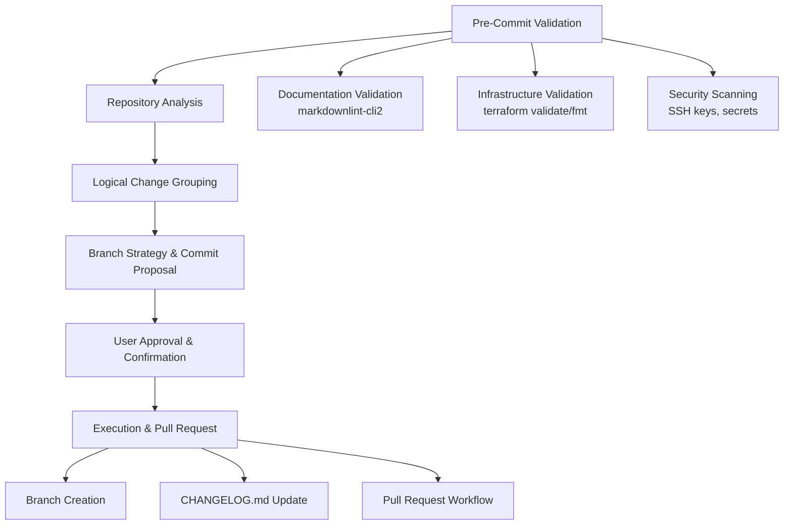

# AI Assistant Instructions Implementation Guide

## Overview

This guide provides implementation details for the AI assistant instructions repository, which combines GitHub Copilot instructions with Claude Code standardized workflows for comprehensive AI-assisted development.

For architectural decisions and design rationale, see [Architecture Details](.copilot/ARCHITECTURE.md).

## Implemented Structure

### Current Repository Architecture

```text
ai-assistant-instructions/
├── README.md                           # Project overview and quick start
├── IMPLEMENTATION_GUIDE.md             # This file - implementation details
├── CHANGELOG.md                        # Project change history
├── LICENSE                             # MIT License
├── .github/                            # GitHub integration and workflows
│   ├── copilot-instructions.md         # Main GitHub Copilot instructions
│   ├── workflows/                      # CI/CD automation
│   │   ├── claude.yml                  # Claude Code GitHub Actions integration
│   │   └── terraform.yml               # Infrastructure validation workflow
│   ├── prompts/                        # Reusable AI prompt templates
│   │   ├── development.md              # Development workflow prompts
│   │   ├── infrastructure.md           # Infrastructure-specific prompts
│   │   ├── git-workflow.prompt.md      # Git workflow automation
│   │   ├── infrastructure-review.prompt.md # Infrastructure review templates
│   │   ├── security-review.prompt.md   # Security assessment prompts
│   │   ├── documentation-check.prompt.md # Documentation validation
│   │   └── git-repository-cleanup.prompt.md # Repository maintenance
│   ├── PULL_REQUEST_TEMPLATE.md        # PR template for consistency
│   └── .copilot-review-instructions.md # GitHub Copilot review guidelines
├── .copilot/                           # Detailed context and architecture
│   ├── PROJECT.md                      # Project scope and boundaries
│   ├── ARCHITECTURE.md                 # Technical decisions and design
│   ├── WORKSPACE.md                    # Multi-project coordination
│   ├── instructions.md                 # Additional AI instructions
│   └── TODO.md                         # Project planning and tasks
└── .claude/                            # Claude Code standardized configuration
    ├── CLAUDE.md                       # Claude Code documentation standards
    ├── settings.json                   # Claude Code permissions and settings
    └── commands/
        └── commit.md                   # Standardized 6-step commit workflow
```

## Key Implementation Decisions

### Dual AI System Architecture

This repository uniquely combines two complementary AI assistant systems:

- **GitHub Copilot Integration**: Repository-wide instructions in `.github/copilot-instructions.md` (84 lines)
- **Claude Code Workflows**: Standardized development processes in `.claude/` directory
- **Shared Prompt Library**: Reusable templates in `.github/prompts/` for both systems
- **Cross-Platform Compatibility**: Works across VS Code, GitHub web interface, and Claude Code CLI

### Hybrid Instruction Strategy

- **Copilot Instructions**: Optimized for real-time code assistance and GitHub integration
- **Claude Code Standards**: Comprehensive workflow automation and documentation practices
- **Unified Documentation**: Consistent standards applied across both AI systems
- **Modular Design**: Independent system configurations with shared best practices

### Documentation Standards

#### Markdown Compliance

- **Linting**: All files validated with `markdownlint-cli2`
- **Formatting**: Consistent structure across documentation
- **Cross-References**: Explicit linking between related files
- **Reading Level**: US middle/high school accessibility

#### Diagramming Standards

##### Primary Choice: Mermaid

- **Use Cases**: Workflows, flowcharts, sequence diagrams, simple architectures
- **Advantages**: Native GitHub rendering, AI-friendly syntax, VS Code integration
- **Language Tag**: Always use `mermaid` in code blocks

##### Secondary Choice: GraphViz (DOT)

- **Use Cases**: Complex network topologies, large system architectures (10+ components)
- **Advantages**: Superior layout algorithms, handles complex interconnections
- **Language Tag**: Always use `dot` in code blocks

#### Claude Code 6-Step Commit Workflow

The repository implements a comprehensive commit workflow process:



## Usage Patterns

### For GitHub Copilot Users

1. **Repository-wide context**: Automatic loading of `.github/copilot-instructions.md`
2. **Real-time assistance**: Copilot applies preferences for AWS us-east-2, cost optimization
3. **Code reviews**: Reference `.github/.copilot-review-instructions.md`
4. **Prompt templates**: Use files in `.github/prompts/` with `@workspace` prefix
5. **GraphQL integration**: Use GitHub GraphQL API for PR comment analysis and external conversation reading (not available via `gh` CLI)

### For Claude Code Users

1. **Standardized workflows**: Execute `/commit` command for 6-step validation process
2. **Comprehensive documentation**: Reference `.claude/CLAUDE.md` for standards
3. **Permission management**: Configured in `.claude/settings.json`
4. **Custom commands**: Available in `.claude/commands/` directory
5. **GraphQL API access**: Uses `gh api graphql` and `jq` for PR comment reading and external conversation analysis - essential for comprehensive PR review

### For Multi-Project Development

1. **Quick reference**: Start with `README.md` for overview
2. **Project scope**: Follow guidelines in `.copilot/PROJECT.md`
3. **Architecture decisions**: Review `.copilot/ARCHITECTURE.md`
4. **Workspace management**: Use `.copilot/WORKSPACE.md` for coordination

### For Documentation Maintenance

1. **Validation**: Run `markdownlint-cli2` before commits
2. **Cross-references**: Maintain accurate links between files
3. **Changelog updates**: Follow calendar versioning (YYYY-MM-DD)
4. **Architectural changes**: Document decisions in appropriate `.copilot/` files

## Quality Assurance

### Automated Validation

#### GitHub Actions Workflows

- **Claude Code Integration**: `.github/workflows/claude.yml` for AI-assisted development
- **Terraform Validation**: `.github/workflows/terraform.yml` for infrastructure checking
- **Documentation Linting**: `markdownlint-cli2` validation on all markdown files
- **Security Scanning**: Pre-commit hooks for sensitive data detection

#### Claude Code Validation Framework

- **Pre-commit Scanning**: SSH keys, API keys, usernames, passwords, certificates
- **Infrastructure Validation**: `terraform validate`, `terraform fmt -check`
- **Resource Naming**: Organizational standard compliance
- **Network Security**: Firewall and access control validation
- **State Management**: Backend security and encryption verification

### Manual Review Standards

#### Documentation Quality

- [ ] Cross-references between files are accurate and functional
- [ ] Code examples include proper language tags (`mermaid`, `dot`, `bash`, etc.)
- [ ] Documentation maintains US middle/high school reading level
- [ ] Cost implications documented for cloud resources
- [ ] Security requirements clearly stated and justified

#### Code Quality

- [ ] Follows existing conventions and patterns
- [ ] Library/framework availability verified before use
- [ ] No hardcoded secrets or credentials
- [ ] Comprehensive error handling implemented
- [ ] Line length under 120 characters where applicable

## Benefits Achieved

### Dual AI System Integration

- **Cross-Platform Compatibility**: Seamless operation across GitHub Copilot and Claude Code
- **Complementary Strengths**: Real-time assistance + comprehensive workflow automation
- **Unified Standards**: Consistent coding practices across both AI systems
- **Enhanced Productivity**: Reduced context switching between different AI tools

### Advanced Workflow Automation

- **6-Step Commit Process**: Comprehensive validation, security scanning, and change management
- **Automated Documentation**: CHANGELOG.md updates with calendar versioning
- **Security First**: Pre-commit scanning for sensitive data and infrastructure validation
- **Quality Assurance**: Automated linting, formatting, and cross-reference validation

### Cost-Conscious Development

- **Budget Guidelines**: Built-in cost awareness for AWS deployments (us-east-2)
- **Resource Optimization**: Preference for cost-effective services and free tier usage
- **Infrastructure Validation**: Terraform/Terragrunt integration with cost impact analysis
- **Monitoring Integration**: AWS DynamoDB permissions for infrastructure tracking

### Professional Development Standards

- **Industry Best Practices**: Conventional commits, security scanning, documentation standards
- **Scalable Architecture**: Template-based approach for consistent project setup
- **Version Control Excellence**: Merge strategy with comprehensive PR workflows
- **Knowledge Management**: Centralized instruction repository with cross-project applicability

## Maintenance Schedule

### Regular Tasks

- **Weekly**: Review AI instruction effectiveness and prompt template usage
- **Monthly**: Validate cross-references, update broken links, review cost optimization
- **Quarterly**: Update technology preferences, review VS Code extension recommendations
- **Annually**: Comprehensive architecture review, permission audits, security assessment

### Update Procedures

#### For GitHub Copilot Instructions

1. **Instruction Updates**: Modify `.github/copilot-instructions.md` (keep under 100 lines)
2. **Prompt Templates**: Add/update files in `.github/prompts/` with usage examples
3. **Cross-References**: Ensure links to `.copilot/` files remain accurate
4. **Validation**: Test with actual Copilot interactions before committing

#### For Claude Code Standards

1. **Workflow Changes**: Update `.claude/commands/commit.md` for process modifications
2. **Permission Updates**: Modify `.claude/settings.json` for new tool requirements
3. **Documentation Standards**: Update `.claude/CLAUDE.md` for guideline changes
4. **Testing**: Validate with `/commit` command execution

#### General Maintenance

1. **Validation**: Run `markdownlint-cli2` and fix all issues
2. **Documentation**: Update this implementation guide for structural changes
3. **Changelog**: Document all changes following calendar versioning
4. **Security Review**: Regular audit of permissions and sensitive data handling

---

## Current Status

The AI assistant instructions repository successfully integrates GitHub Copilot and Claude Code systems with:

- ✅ Dual AI system compatibility
- ✅ Comprehensive 6-step commit workflow
- ✅ Automated security scanning and validation
- ✅ Cost-conscious development guidelines
- ✅ Professional documentation standards
- ✅ GitHub Actions CI/CD integration

### Technology Integration

- **GitHub Copilot**: Real-time coding assistance with repository-wide context
- **Claude Code**: Standardized workflow automation with comprehensive validation
- **GitHub GraphQL API**: Essential for PR comment/conversation analysis (unavailable in `gh` CLI) - use `gh api graphql` with basic syntax
- **Terraform/Terragrunt**: Infrastructure as code with security and cost optimization
- **AWS Integration**: Cost-conscious deployments with monitoring capabilities

For detailed implementation specifics, reference the comprehensive documentation in the `.copilot/` directory and
follow the established patterns for future enhancements.
