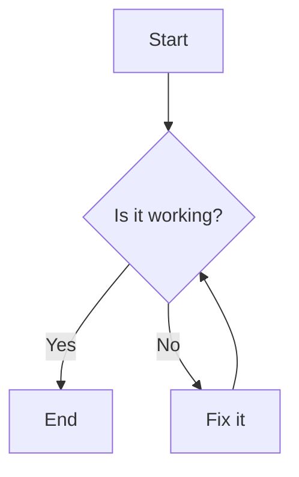

# Concept: Diagramming Standards

This document outlines the standards for creating diagrams within this project.

## Primary Choice: Mermaid

- **Use Cases**: Workflows, flowcharts, sequence diagrams, simple architectures.
- **Advantages**: Native GitHub rendering, AI-friendly syntax, excellent VS Code integration.
- **Language Tag**: Always use `mermaid` in your markdown code blocks.

### Example

````markdown

````

## Secondary Choice: GraphViz (DOT)

- **Use Cases**: Complex network topologies, large system architectures (10+ components).
- **Advantages**: Superior layout algorithms for complex, interconnected graphs.
- **Language Tag**: Always use `dot` in your markdown code blocks.
